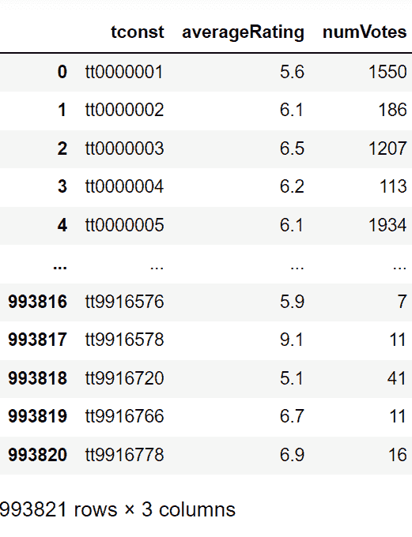
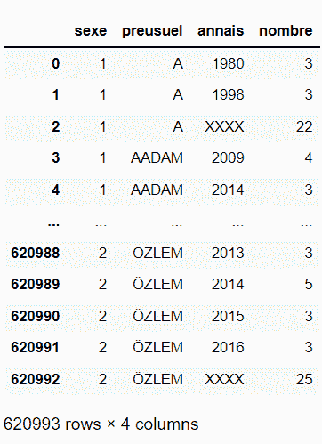

# 如何将 TSV 文件加载到熊猫数据帧中？

> 原文:[https://www . geesforgeks . org/how-a-tsv-file-in-a-pandas-data frame/](https://www.geeksforgeeks.org/how-to-load-a-tsv-file-into-a-pandas-dataframe/)

在本文中，我们将讨论如何将 TSV 文件加载到熊猫数据帧中。

思路极其简单我们只需要先导入所有需要的库，然后使用 [read_csv()](https://www.geeksforgeeks.org/python-read-csv-using-pandas-read_csv/) 方法加载数据集即可。向该方法简单地传递数据帧的路径。这足以完成工作。

**语法:**

> pandas.read_csv(路径，sep='\t ')

下面给出了相同的一些实现。

**示例 1:** 将 TSV 数据集加载到熊猫数据框中

**使用的数据集:** [数据](https://drive.google.com/file/d/1UgzKdu8NadlQqCQnXyfqnTPXXqXO4Bij/view?usp=sharing)

## 蟒蛇 3

```
import pandas as pd

# Data.tsv is stored locally in the 
# same directory as of this python file
df = pd.read_csv('data.tsv',sep = '\t') 
df
```

**输出:**



**示例 2:** 将 TSV 数据集加载到熊猫数据框中

**使用的数据集:**[baby name . tsv](https://drive.google.com/file/d/1TqQXqqGOPzvQSphPngD_o47HtW_G0en1/view?usp=sharing)

## 蟒蛇 3

```
import pandas as pd

df = pd.read_csv('babynames.tsv', sep = '\t')
df
```

**输出:**

