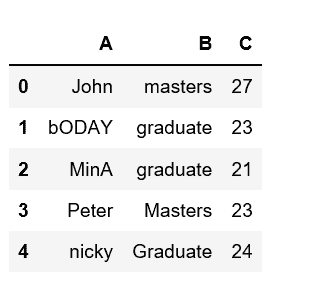
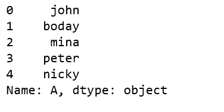

# 熊猫数据框中如何小写列名

> 原文:[https://www . geesforgeks . org/如何小写-熊猫中的列名-dataframe/](https://www.geeksforgeeks.org/how-to-lowercase-column-names-in-pandas-dataframe/)

分析真实世界的数据有些困难，因为我们需要考虑各种因素。除了从大型数据集中获取有用的数据之外，将数据保持在所需的格式也非常重要。

人们可能会遇到这样的情况，我们需要将给定数据框中任何特定列的每个字母都小写。让我们看看如何在熊猫数据框中使用小写的列名。

让我们从列表字典中创建一个数据框架。

```py
# Create a simple dataframe

# importing pandas as pd
import pandas as pd

# creating a dataframe
df = pd.DataFrame({'A': ['John', 'bODAY', 'MinA', 'Peter', 'nicky'],
                  'B': ['masters', 'graduate', 'graduate',
                                   'Masters', 'Graduate'],
                  'C': [27, 23, 21, 23, 24]})

df
```

**输出:**


有一些方法我们可以改变/修改熊猫数据框中列的大小写。让我们看看如何使用`lower()`方法在熊猫数据框中小写列名。

**方法#1:**

```py
# Create a simple dataframe

# importing pandas as pd
import pandas as pd

# creating a dataframe
df = pd.DataFrame({'A': ['John', 'bODAY', 'MinA', 'Peter', 'nicky'],
                  'B': ['masters', 'graduate', 'graduate', 
                                   'Masters', 'Graduate'],
                  'C': [27, 23, 21, 23, 24]})

df['A'] = df['A'].str.lower()

df
```

**输出:**


**方法#2:**

```py
# Create a simple dataframe

# importing pandas as pd
import pandas as pd

# creating a dataframe
df = pd.DataFrame({'A': ['John', 'bODAY', 'MinA', 'Peter', 'nicky'],
                  'B': ['masters', 'graduate', 'graduate',
                                   'Masters', 'Graduate'],
                  'C': [27, 23, 21, 23, 24]})

df['A'].apply(lambda x: x.lower())
```

**输出:**
