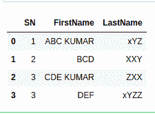

# 如何操纵熊猫的琴弦？

> 原文:[https://www . geeksforgeeks . org/如何操纵熊猫串/](https://www.geeksforgeeks.org/how-to-manipulate-strings-in-pandas/)

熊猫库提供了多种方法，可以根据需要的输出来操作字符串。但是首先，让我们创建一个熊猫数据框架。

## 蟒蛇 3

```
import pandas as pd

data = [[1, "ABC KUMAR", "xYZ"], [2, "BCD", "XXY"],
        [3, "CDE KUMAR", "ZXX"], [3, "DEF", "xYZZ"]]

cfile = pd.DataFrame(data, columns = ["SN", "FirstName", "LastName"])

cfile
```

**输出:**



**“熊猫”**库提供了一个“**”。str()"** 方法，可用于将数据框中的任何数据创建为字符串，此后，python 文档或本文[中定义的任何字符串操作都可以用于该数据。](https://www.geeksforgeeks.org/python-strings/)

下面是说明一些示例的代码

## 蟒蛇 3

```
# find firstname starting with 'D'
result = cfile.FirstName.str.startswith('D')
print(result)

# find lasttname containing 'XX'
result = cfile.LastName.str.contains('XX')
print(result)

# split FirstName on the basis of ' '
result = cfile.FirstName.str.split()
print(result)

# find length of lasttname
result = cfile.LastName.str.len()
print(result)

# Capitalize the first Letter of LastName
result = cfile.LastName.str.capitalize()
print(result)

# Capitalize all Letter of LastName
result = cfile.LastName.str.upper()
print(result)

# Convert all Letter of LastName to lowercase
result = cfile.LastName.str.lower()
print(result)
```

**输出:**

```
0    False
1    False
2    False
3     True
Name: FirstName, dtype: bool
0    False
1     True
2     True
3    False
Name: LastName, dtype: bool
0    [ABC, KUMAR]
1           [BCD]
2    [CDE, KUMAR]
3           [DEF]
Name: FirstName, dtype: object
0    3
1    3
2    3
3    4
Name: LastName, dtype: int64
0     Xyz
1     Xxy
2     Zxx
3    Xyzz
Name: LastName, dtype: object
0     XYZ
1     XXY
2     ZXX
3    XYZZ
Name: LastName, dtype: object
0     xyz
1     xxy
2     zxx
3    xyzz
Name: LastName, dtype: object
```