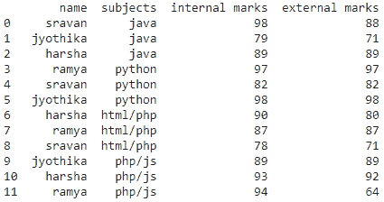
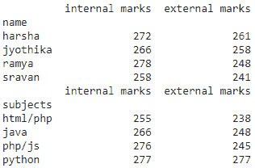
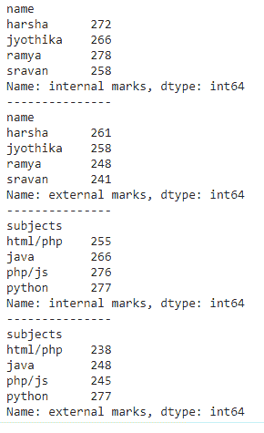
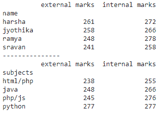

# 如何在熊猫身上执行 SUMIF 功能？

> 原文:[https://www . geesforgeks . org/如何在熊猫中执行 sumif 功能/](https://www.geeksforgeeks.org/how-to-perform-a-sumif-function-in-pandas/)

sumif()函数用于对数据框中的一组项目进行求和运算，可以应用于单列和多列，我们也可以将该函数与 [groupby](https://www.geeksforgeeks.org/python-pandas-dataframe-groupby/) 函数配合使用。

## 方法 1:用 groupby()对所有列进行 SUMIF

此函数用于显示所有列相对于分组列的总和

> **语法:**data frame . group by(' group _ column ')。总和()
> 
> 在哪里
> 
> *   数据帧是输入数据帧
> *   group_column 是数据框中要分组的列
> *   sum()函数用于执行求和操作

### 创建包含 4 列的学生数据框

## 蟒蛇 3

```
# import pandas module
import pandas as pd

# create dataframe with 4 columns
data = pd.DataFrame({

    "name": ['sravan', 'jyothika', 'harsha', 
             'ramya', 'sravan', 'jyothika', 
             'harsha', 'ramya', 'sravan', 'jyothika',
             'harsha', 'ramya'],
    "subjects": ['java', 'java', 'java', 'python',
                 'python', 'python', 'html/php', 
                 'html/php', 'html/php', 'php/js',
                 'php/js', 'php/js'],
    "internal marks": [98, 79, 89, 97, 82, 98, 90,
                       87, 78, 89, 93, 94],
    "external marks": [88, 71, 89, 97, 82, 98, 80,
                       87, 71, 89, 92, 64],
})

# display dataframe
print(data)
```

**输出**:



### 通过对特定列进行分组来对所有列求和

## 蟒蛇 3

```
# import pandas module
import pandas as pd

# create dataframe with 4 columns
data = pd.DataFrame({

    "name": ['sravan', 'jyothika', 'harsha', 'ramya',
             'sravan', 'jyothika', 'harsha', 'ramya',
             'sravan', 'jyothika', 'harsha', 'ramya'],
    "subjects": ['java', 'java', 'java', 'python',
                 'python', 'python', 'html/php',
                 'html/php', 'html/php', 'php/js',
                 'php/js', 'php/js'],
    "internal marks": [98, 79, 89, 97, 82, 98, 90,
                       87, 78, 89, 93, 94],
    "external marks": [88, 71, 89, 97, 82, 98, 80,
                       87, 71, 89, 92, 64],
})

# find sum of all columns group by name
print(data.groupby('name').sum())

# find sum of all columns group by subjects
print(data.groupby('subjects').sum())
```

**输出:**



## 方法 2:一列上的 SUMIF 函数

这里我们对一个特定的列执行 sumif 操作，将它与一个列分组

> **语法:**data frame . group by(' group _ column ')[' column _ name]。总和()
> 
> 在哪里
> 
> *   数据帧是输入数据帧
> *   group_column 是数据框中要分组的列
> *   column_name 是获取此列相对于分组列的总和
> *   sum()函数用于执行求和操作

## 蟒蛇 3

```
# import pandas module
import pandas as pd

# create dataframe with 4 columns
data = pd.DataFrame({

    "name": ['sravan', 'jyothika', 'harsha', 'ramya',
             'sravan', 'jyothika', 'harsha', 'ramya', 
             'sravan', 'jyothika', 'harsha', 'ramya'],
    "subjects": ['java', 'java', 'java', 'python',
                 'python', 'python', 'html/php', 
                 'html/php', 'html/php', 'php/js',
                 'php/js', 'php/js'],
    "internal marks": [98, 79, 89, 97, 82, 98, 90,
                       87, 78, 89, 93, 94],
    "external marks": [88, 71, 89, 97, 82, 98, 80,
                       87, 71, 89, 92, 64],
})

# find sum of  columns group by
# name with internal marks column
print(data.groupby('name')['internal marks'].sum())

print("---------------")

# find sum of  columns group by
# name with external marks column
print(data.groupby('name')['external marks'].sum())

print("---------------")

# find sum of  columns group by
# subjects with internal marks column
print(data.groupby('subjects')['internal marks'].sum())

print("---------------")

# find sum of  columns group by
# subjects with external marks column
print(data.groupby('subjects')['external marks'].sum())
```

**输出:**



## 方法 3:多列上的 SUMIF 操作

这里我们将对多列使用 sumif 操作。

> **语法:**data frame . group by(' group _ column ')[[' column _ name ']]。总和()
> 
> 哪里，
> 
> *   数据帧是输入数据帧
> *   group_column 是数据框中要分组的列
> *   column _ names 用于获取这些列相对于分组列的总和
> *   sum()函数用于执行求和操作

## 蟒蛇 3

```
# import pandas module
import pandas as pd

# create dataframe with 4 columns
data = pd.DataFrame({

    "name": ['sravan', 'jyothika', 'harsha', 'ramya',
             'sravan', 'jyothika', 'harsha', 'ramya', 
             'sravan', 'jyothika', 'harsha', 'ramya'],
    "subjects": ['java', 'java', 'java', 'python',
                 'python', 'python', 'html/php', 
                 'html/php', 'html/php', 'php/js', 
                 'php/js', 'php/js'],
    "internal marks": [98, 79, 89, 97, 82, 98, 90,
                       87, 78, 89, 93, 94],
    "external marks": [88, 71, 89, 97, 82, 98, 80,
                       87, 71, 89, 92, 64],
})

# find sum of  columns group by name with
# external marks and internal marks column
print(data.groupby('name')[['external marks',
                            'internal marks']].sum())

print("---------------")

# find sum of  columns group by subjects
# with external marks and internal marks column
print(data.groupby('subjects')[['external marks',
                                'internal marks']].sum())
```

**输出:**

