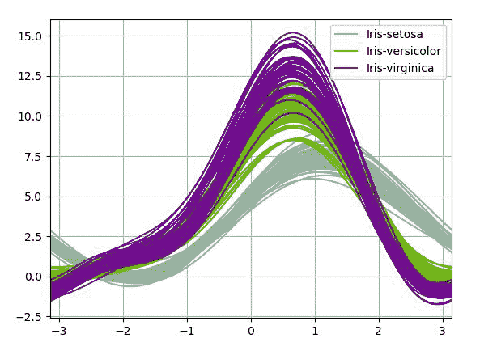

# 如何用 Python 中的熊猫绘制安德鲁斯曲线？

> 原文:[https://www . geeksforgeeks . org/如何绘制-安德鲁斯-曲线-使用-python 中的熊猫/](https://www.geeksforgeeks.org/how-to-plot-andrews-curves-using-pandas-in-python/)

安德鲁斯曲线通过将每个观察值映射到一个函数来可视化高维数据。它保留了平均值、距离和方差。它由公式给出:

> t(n)= x _ 1/sqrt(2)+x _ 2 sin(n)+x _ 3 cos(n)+x _ 4 sin(2n)+x _ 5 cos(2n)+…

可以使用绘图模块的**安德鲁斯 _curves()** 方法在图形上绘制安德鲁斯曲线。该函数生成安德鲁斯曲线的 matplotlib 图，用于可视化多变量数据的聚类。

> **语法:** andrews_curves(frame，class_column，ax=None，samples=200，color=None，colormap=None，**kwargs)
> 
> **参数:**
> 
> *   **帧:**是要绘制的数据。
> *   **class_column:** 这是包含类名的列的名称。
> *   **ax:** 该参数是 matplotlib axes 对象。其默认值为“无”。
> *   **样本:**此参数是每条曲线中要绘制的点数。
> *   **颜色:**这个参数是一个可选参数，它是用于不同类别的颜色列表或元组。
> *   **colormap:** 此参数为 string/matplotlib colormap 对象。其默认值为“无”。
> 
> **返回:**这个函数返回一个类的对象***matplotlip . axis***

**示例 1:** 在以下示例中，数据框由 CSV 文件制成，该数据框用于绘制 andrews_curves。使用的 CSV 文件是[这里是](https://drive.google.com/file/d/1SbeM42PKEv0lsaypGISWOfdT46SzaLSO/view?usp=sharing)。

## 蟒蛇 3

```py
# importing various package
import pandas as pd
import numpy as np
import matplotlib.pyplot as plt

# making data frame from csv file
df = pd.read_csv(
    'C:\\Users\\digital india\\Desktop\\pand.csv'
)

# Creating Andrews curves
x = pd.plotting.andrews_curves(df, 'animal')

# ploting the Curve
x.plot()

# Display
plt.show()
```

**输出:**


**例 2:**

## 蟒蛇 3

```py
# importing various package
import pandas as pd
import numpy as np
import matplotlib.pyplot as plt

# making data frame from csv file
df = pd.read_csv(
    'https://raw.github.com/pandas-dev/'
    'pandas/master/pandas/tests/io/data/csv/iris.csv'
)

# Creating Andrews curves
x = pd.plotting.andrews_curves(df, 'Name')

# ploting the Curve
x.plot()

# Display
plt.show()
```

**输出:**

