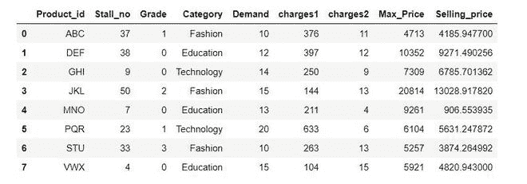

# 如何漂亮地打印整个熊猫系列或数据帧？

> 原文:[https://www . geeksforgeeks . org/如何漂亮地打印整个熊猫系列或数据框/](https://www.geeksforgeeks.org/how-to-pretty-print-an-entire-pandas-series-or-dataframe/)

在这篇文章中，我们将看到如何漂亮地打印整个熊猫系列/数据帧。

**有 2 种方法可以漂亮地打印整个熊猫系列/数据框:**

*   使用 pd.set_options()方法
*   使用 pd.option_context()方法

**方法一:使用 pd.set_options()方法**

设置指定选项的值。有各种漂亮的打印选项可用于这种方法。

例如 display.max_columns、display.max_colwidth、display.max_rows、display . colheader _ alignment、display.precision 等。下面讨论一些漂亮的打印选项:

*   **display.max_columns:** 熊猫应该打印的最大列数。如果没有提供参数，则打印所有列。
*   **display.max_rows** :熊猫应该打印的最大行数。如果没有提供参数，则打印所有行。
*   **display . colheader _ alignment**:控制列标题的对齐
*   **display.precision** :浮点输出精度，以小数点后的位数表示，用于常规格式和科学符号。
*   **display.date_dayfirst** :为 True 时，打印并解析以第一天为准的日期，如 2020 年 12 月 20 日
*   **display.date_yearfirst** :如果为 True，则打印和解析以年为单位的日期，例如 2020/12/20
*   **显示宽度**:以字符为单位的显示宽度。如果设置为无，熊猫将正确自动检测宽度。

**下面是实现:**

## 蟒蛇 3

```
import pandas as pd

# Create a dataframe
df = pd.DataFrame({
  'Product_id': ['ABC', 'DEF', 'GHI', 'JKL', 
                 'MNO', 'PQR', 'STU', 'VWX'],

  'Stall_no': [37, 38, 9, 50, 7, 23, 33, 4],
  'Grade': [1, 0, 0, 2, 0, 1, 3, 0],

  'Category': ['Fashion', 'Education', 'Technology', 
               'Fashion', 'Education', 'Technology', 
               'Fashion', 'Education'],

  'Demand': [10, 12, 14, 15, 13, 20, 10, 15],
  'charges1': [376, 397, 250, 144, 211, 633, 263, 104],
  'charges2': [11, 12, 9, 13, 4, 6, 13, 15],
  'Max_Price': [4713, 10352, 7309, 20814, 9261, 
                6104, 5257, 5921],

  'Selling_price': [4185.9477, 9271.490256, 6785.701362, 
                    13028.91782, 906.553935, 5631.247872, 
                    3874.264992, 4820.943]})
display(df)
```

**输出:**



我们将使用上述 df 上 set_options()方法的一些选项来查看所有行、所有列、一行中具有居中对齐的列标题的所有列，并将每个浮点值的小数后的位数舍入为 2。

## 蟒蛇 3

```
pd.set_option('display.max_rows', None)
pd.set_option('display.max_columns', None)
pd.set_option('display.width', 1000)
pd.set_option('display.colheader_justify', 'center')
pd.set_option('display.precision', 2)
display(df)
```