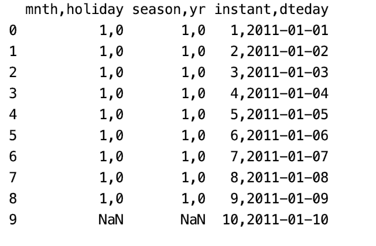

# 如何将多个数据文件读入熊猫？

> 原文:[https://www . geesforgeks . org/如何将多个数据文件读入熊猫/](https://www.geeksforgeeks.org/how-to-read-multiple-data-files-into-pandas/)

在本文中，我们将看到如何将多个数据文件读入 pandas，数据文件有多种类型，这里有几个方法可以通过使用 python 中的 pandas 包来读取多个文件。

演示文件可以从[这里](https://drive.google.com/drive/folders/1lEQA8EXOFpyOgjLMLMqY7_d0d9r7dpAY?usp=sharing)下载

## 方法 1:读取 CSV 文件

如果我们的数据文件是 CSV 格式，那么必须使用 read_csv()方法。read_csv 以文件路径作为参数。它读取 CSV 的内容。要读取多个 CSV 文件，我们只需使用一个简单的 for 循环并遍历所有文件。

**示例:使用熊猫读取多个 CSV 文件**

在本例中，我们列出了数据文件或文件路径，然后使用 for 循环遍历文件路径，for 循环用于遍历列表、元组、字符串等项。然后用 pd 创建一个数据帧。DataFrame()，使用 pd.concat()将每个数据帧连接成一个主数据帧，然后使用 to_csv()方法将最终的主数据帧转换成 csv 文件，该方法将我们要创建的新 CSV 文件的名称作为参数。

## 蟒蛇 3

```py
# importing pandas
import pandas as pd

file_list=['a.csv','b.csv','c.csv']

main_dataframe = pd.DataFrame(pd.read_csv(file_list[0]))

for i in range(1,len(file_list)):
    data = pd.read_csv(file_list[i])
    df = pd.DataFrame(data)
    main_dataframe = pd.concat([main_dataframe,df],axis=1)
print(main_dataframe)
```

**输出:**


## 方法 2:使用 glob 包

python 中的 glob 模块用于检索与指定模式匹配的文件或路径名。

这个程序类似于上面的程序，但唯一的区别是，我们使用 glob 包来检索与指定模式匹配的文件，而不是使用列表来跟踪文件名。

**示例:使用 Pandas 和 glob 读取多个 CSV 文件。**

## 蟒蛇 3

```py
# importing packages
import pandas as pd
import glob

folder_path = 'Path_of_file/csv_files'
file_list = glob.glob(folder_path + "/*.csv")
main_dataframe = pd.DataFrame(pd.read_csv(file_list[0]))
for i in range(1,len(file_list)):
    data = pd.read_csv(file_list[i])
    df = pd.DataFrame(data)
    main_dataframe = pd.concat([main_dataframe,df],axis=1)
print(main_dataframe)
```

**输出:**


## 方法 3:使用熊猫读取文本文件:

要读取文本文件，必须使用 panda 的 read_table()方法。

**示例:使用熊猫和 glob 读取文本文件。**

使用 glob package 检索文件或路径名，然后使用 for 循环遍历文件路径。使用 pd.read_table()方法读取每个文件后，创建该文件内容的数据框，该方法将文件路径作为参数。使用 pd.concat()将每个数据帧连接成主数据帧，然后使用 to_csv()方法将最终的主数据帧转换成 csv 文件，该方法将我们要创建的新 CSV 文件的名称作为参数。

## 蟒蛇 3

```py
# importing packages
import pandas as pd
import glob

folder_path = 'Path_/files'
file_list = glob.glob(folder_path + "/*.txt")
main_dataframe = pd.DataFrame(pd.read_table(file_list[0]))

for i in range(1,len(file_list)):
    data = pd.read_table(file_list[i])
    df = pd.DataFrame(data)
    main_dataframe = pd.concat([main_dataframe, df], axis = 1)

print(main_dataframe)

# creating a new csv file with
# the dataframe we created
main_dataframe.to_csv('new_csv1.csv')
```

**输出:**

