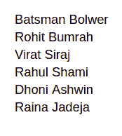

# 如何用熊猫读取文本文件？

> 原文:[https://www . geesforgeks . org/如何阅读带熊猫的文本文件/](https://www.geeksforgeeks.org/how-to-read-text-files-with-pandas/)

在本文中，我们将讨论如何在 python 中用 pandas 读取文本文件。在 python 中，pandas 模块允许我们从外部文件加载数据帧并对其进行处理。数据集可以在不同类型的文件中。

**使用的文本文件:**



## 方法一:使用 [read_csv()](https://www.geeksforgeeks.org/python-read-csv-using-pandas-read_csv/)

我们将使用 read_csv()函数读取带有熊猫的文本文件。除了文本文件，我们还将分隔符作为单个空格(“”)传递给空格字符，因为对于文本文件，空格字符将分隔每个字段。我们可以向 read_csv()函数传递三个参数。

**语法:**

> data = pandas . read _ CSV(' filename . txt '，sep= ' '，header=None，name =[" column 1 "，" Column2"])
> 
> **参数:**
> 
> *   **filename.txt:** 顾名思义就是我们要从中读取数据的文本文件的名称。
> *   **sep** :是一个分隔符字段。在文本文件中，我们使用空格字符(“”)作为分隔符。
> *   **表头:**这是可选字段。默认情况下，它会将文本文件的第一行作为标题。如果我们使用头=无，那么它将创建头。
> *   **名称:**我们可以在导入文本文件时使用 name 参数分配列名。

**例 1:**

## 蟒蛇 3

```
# Read Text Files with Pandas using read_csv()

# importing pandas
import pandas as pd

# read text file into pandas DataFrame
df = pd.read_csv("gfg.txt", sep=" ")

# display DataFrame
print(df)
```

**输出:**


**例 2:**

在示例 2 中，我们将使标题字段等于无。这将在输出中创建一个默认标题。并将文本文件的第一行作为数据输入。创建的标题名称将是一个从 0 开始的数字。

## 蟒蛇 3

```
# Read Text Files with Pandas using read_csv()

# importing pandas
import pandas as pd

# read text file into pandas DataFrame and
# create header
df = pd.read_csv("gfg.txt", sep=" ", header=None)

# display DataFrame
print(df)
```

**输出:**


**例 3:**

在上面的输出中，我们可以看到它创建了一个从数字 0 开始的头。但是我们也可以给标题命名。在这个例子中，我们将看到如何使用熊猫创建一个带有名称的标题。

## 蟒蛇 3

```
# Read Text Files with Pandas using read_csv()

# importing pandas
import pandas as pd

# read text file into pandas DataFrame and create 
# header with names
df = pd.read_csv("gfg.txt", sep=" ", header=None, 
                 names=["Team1", "Team2"])

# display DataFrame
print(df)
```

**输出:**


## 方法二:使用 [read_table()](https://www.geeksforgeeks.org/pandas-read_table-function/)

在 pandas 中，我们可以使用 read_table()从文本文件中读取数据。该函数将一般的分隔文件读取到数据框对象中。该函数本质上与 read_csv()函数相同，但默认情况下使用分隔符= '\t '，而不是逗号。我们将使用 read_table 函数读取数据，使分隔符等于一个空格(“”)。

**语法:**

```
data=pandas.read_table('filename.txt', delimiter = ' ')
```

**示例:**

## 蟒蛇 3

```
# Read Text Files with Pandas using read_table()

# importing pandas
import pandas as pd

# read text file into pandas DataFrame
df = pd.read_table("gfg.txt", delimiter=" ")

# display DataFrame
print(df)
```

### 输出:


## 方法 3:使用 read_fwf()

read_fwf()函数中的 fwf 代表固定宽度的线条。我们可以使用这个函数从文件中加载数据帧。该功能还支持文本文件。我们将使用熊猫的 read_fef()函数从文本文件中读取数据。它还支持可选地迭代文件或将文件分成块。由于文本文件中的列是以固定的宽度分隔的，因此 read_fef()可以有效地将内容读入单独的列。

**语法:**

```
data=pandas.read_fwf('filename.txt')
```

**示例:**

## 蟒蛇 3

```
# Read Text Files with Pandas using read_fwf()

# importing pandas
import pandas as pd

# read text file into pandas DataFrame
df = pd.read_fwf("gfg.txt")

# display DataFrame
print(df)
```

**输出:**

