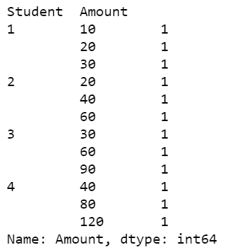
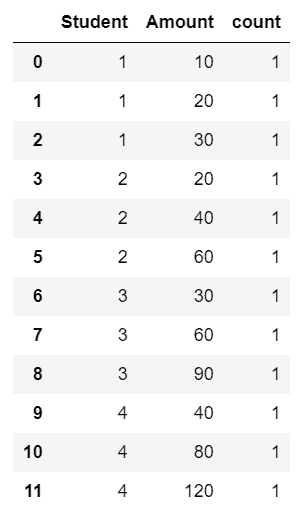
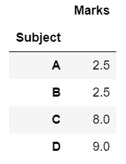

# group by 熊猫后如何重置索引？

> 原文:[https://www . geesforgeks . org/group by-pandas 后如何重置索引/](https://www.geeksforgeeks.org/how-to-reset-index-after-groupby-pandas/)

Python 的 *groupby()* 功能多才多艺。它用于根据一些标准将数据分组，如*平均值、中位数、数值计数、*等。为了在 *groupby()* 之后重置索引，我们将使用 *reset_index()* 功能。

**以下是描述如何在** ***熊猫*** **:** 中***group by()*****后重置索引的各种示例**

**例 1**

## 蟒蛇 3

```
# import required modules
import numpy as np
import pandas as pd

# creating dataframe
df = pd.DataFrame({'Subject': ['Physics', 
                               'Chemistry', 
                               'Maths'], 
                   'Marks': [4, 8, 5]})

# grouping the data on the basis of 
# subject and mean of marks.
df_grouped = df.groupby(['Subject']).mean()

# display dataset
df_grouped
```

**输出:**


数据分组后重置索引，使用 *reset_index()，*是 python 提供的给数据添加索引的功能。

## 蟒蛇 3

```
# reset index
df_grouped.reset_index()
```

**输出:**


**例 2:**

正在创建数据框。

## 蟒蛇 3

```
# import required modules
import pandas as pd
import numpy as np

# creating dataframe
df2 = pd.DataFrame({'Student': [1, 2, 3, 4, 1, 3, 2, 4, 1, 2, 4, 3],
                    'Amount': [
                   10, 20, 30, 40, 20, 60, 40, 80, 30, 60, 120, 90]})

# grouping the data
df2_group = df2.groupby(['Student'])

# grouped on the basis of students and
# with the value of count of amount
df2_grouped = df2_group['Amount'].value_counts()

# display dataset
print(df2_grouped)
```

**输出:**



重置索引。这会给你一个错误。

## 蟒蛇 3

```
# this will generate an error.
df2_grouped.reset_index()
```

**输出:**


命名 *reset_index()* 将对索引进行分组和重置。

## 蟒蛇 3

```
# resetting index on the basis of count
df2_grouped.reset_index(name = 'count')
```

**输出:**



**例 3**

这里还有一个例子来描述如何在使用 *groupby()后重置 dataframe。*

## 蟒蛇 3

```
# import required modules
import numpy as np
import pandas as pd

# creating dataframe
df = pd.DataFrame({'Subject': ['B', 
                               'C', 
                               'A','D','C','B','A'], 
                   'Marks': [4, 8, 5,9,8,1,0]})

# grouping the data on the basis of 
# subject and mean of marks.
df_grouped = df.groupby(['Subject']).mean()

# display dataset
df_grouped

# reset index
df_grouped.reset_index()
```

**输出:**

 