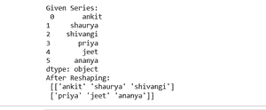

# 熊猫系列如何重塑？

> 原文:[https://www.geeksforgeeks.org/how-to-reshape-pandas-series/](https://www.geeksforgeeks.org/how-to-reshape-pandas-series/)

在这篇文章中，我们将看到如何重塑[熊猫系列](https://www.geeksforgeeks.org/python-pandas-series/)。所以，对于熊猫系列的重塑，我们使用**重塑()**熊猫系列对象的方法。

> **语法:**熊猫。series . values . resform((维度))
> 
> **返回:**如果指定的形状与当前形状完全匹配，则返回一个带有 values 形状的数组，然后返回 self(对于 compat)

让我们看一些例子:

**例 1:**

## 蟒蛇 3

```py
# import pandas library
import pandas as pd

# make an array
array = [2, 4, 6, 8, 10, 12]

# create a series
series_obj = pd.Series(array)

# convert series object into array
arr = series_obj.values

# reshaping series 
reshaped_arr = arr.reshape((3, 2))

# show 
reshaped_arr
```

**输出:**


**例 2:**

## 蟒蛇 3

```py
# import pandas library
import pandas as pd

# make an array
array = ["ankit","shaurya",
         "shivangi", "priya",
         "jeet","ananya"]

# create a series
series_obj = pd.Series(array)

print("Given Series:\n", series_obj)

# convert series object into array
arr = series_obj.values

# reshaping series 
reshaped_arr = arr.reshape((2, 3))

# show 
print("After Reshaping: \n", reshaped_arr)
```

**输出:**

