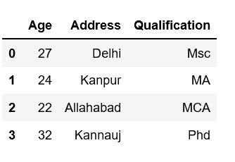
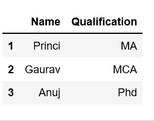
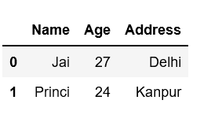
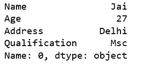
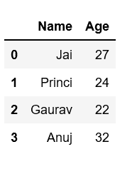
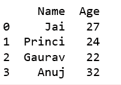

# 如何在熊猫数据框中选择多列

> 原文:[https://www . geesforgeks . org/如何选择多列熊猫-数据框/](https://www.geeksforgeeks.org/how-to-select-multiple-columns-in-a-pandas-dataframe/)

Python 是进行数据分析的优秀语言，主要是因为以数据为中心的 Python 包的奇妙生态系统。 ***【熊猫】*** 就是其中一个包，让导入和分析数据变得容易多了。

让我们讨论在熊猫[数据框](https://www.geeksforgeeks.org/python-pandas-dataframe/)中选择多列的所有不同方法。

**方法#1:** 基本方法

给定一个字典，其中包含作为关键字的雇员实体和作为值的这些实体的列表。

```
# Import pandas package
import pandas as pd

# Define a dictionary containing employee data
data = {'Name':['Jai', 'Princi', 'Gaurav', 'Anuj'],
        'Age':[27, 24, 22, 32],
        'Address':['Delhi', 'Kanpur', 'Allahabad', 'Kannauj'],
        'Qualification':['Msc', 'MA', 'MCA', 'Phd']}

# Convert the dictionary into DataFrame 
df = pd.DataFrame(data)

# select two columns
df[['Name', 'Qualification']]
```

**输出:**


选择第二至第四列。

```
# Import pandas package
import pandas as pd

# Define a dictionary containing employee data
data = {'Name':['Jai', 'Princi', 'Gaurav', 'Anuj'],
        'Age':[27, 24, 22, 32],
        'Address':['Delhi', 'Kanpur', 'Allahabad', 'Kannauj'],
        'Qualification':['Msc', 'MA', 'MCA', 'Phd']}

# Convert the dictionary into DataFrame 
df = pd.DataFrame(data)

# select all rows 
# and second to fourth column
df[df.columns[1:4]]
```

**输出:**


**方法 2:** 使用`[loc[]](https://www.geeksforgeeks.org/python-pandas-extracting-rows-using-loc/)`

**示例 1:** 选择两列

```
# Import pandas package
import pandas as pd

# Define a dictionary containing employee data
data = {'Name':['Jai', 'Princi', 'Gaurav', 'Anuj'],
        'Age':[27, 24, 22, 32],
        'Address':['Delhi', 'Kanpur', 'Allahabad', 'Kannauj'],
        'Qualification':['Msc', 'MA', 'MCA', 'Phd']}

# Convert the dictionary into DataFrame 
df = pd.DataFrame(data)

# select three rows and two columns
df.loc[1:3, ['Name', 'Qualification']]
```

**输出:**


**示例 2:** 选择一列到另一列。在我们的例子中，我们选择列名“名称”到“地址”。

```
# Import pandas package
import pandas as pd

# Define a dictionary containing employee data
data = {'Name':['Jai', 'Princi', 'Gaurav', 'Anuj'],
        'Age':[27, 24, 22, 32],
        'Address':['Delhi', 'Kanpur', 'Allahabad', 'Kannauj'],
        'Qualification':['Msc', 'MA', 'MCA', 'Phd']}

# Convert the dictionary into DataFrame 
df = pd.DataFrame(data)

# select two rows and 
# column "name" to "Address"
# Means total three columns
df.loc[0:1, 'Name':'Address']
```

**输出:**


**示例 3:** 首先按标签格式过滤行和选择列，然后选择所有列。

```
# Import pandas package
import pandas as pd

# Define a dictionary containing employee data
data = {'Name':['Jai', 'Princi', 'Gaurav', 'Anuj'],
        'Age':[27, 24, 22, 32],
        'Address':['Delhi', 'Kanpur', 'Allahabad', 'Kannauj'],
        'Qualification':['Msc', 'MA', 'MCA', 'Phd']
       }
# Convert the dictionary into DataFrame 
df = pd.DataFrame(data)

# .loc DataFrame method
# filtering rows and selecting columns by label
# format
# df.loc[rows, columns]
# row 1, all columns
df.loc[0, :]
```

**输出:**


**方法 3:** 使用`[iloc[]](https://www.geeksforgeeks.org/python-extracting-rows-using-pandas-iloc/)`

**例 1:** 选择前两列。

```
# Import pandas package
import pandas as pd

# Define a dictionary containing employee data
data = {'Name':['Jai', 'Princi', 'Gaurav', 'Anuj'],
        'Age':[27, 24, 22, 32],
        'Address':['Delhi', 'Kanpur', 'Allahabad', 'Kannauj'],
        'Qualification':['Msc', 'MA', 'MCA', 'Phd']}

# Convert the dictionary into DataFrame 
df = pd.DataFrame(data)

# Remember that Python does not
# slice inclusive of the ending index.
# select all rows 
# select first two column
df.iloc[:, 0:2] 
```

**输出:**


**示例 2:** 选择所有或部分列，使用 iloc 逐个选择。

```
# Import pandas package
import pandas as pd

# Define a dictionary containing employee data
data = {'Name':['Jai', 'Princi', 'Gaurav', 'Anuj'],
        'Age':[27, 24, 22, 32],
        'Address':['Delhi', 'Kanpur', 'Allahabad', 'Kannauj'],
        'Qualification':['Msc', 'MA', 'MCA', 'Phd']}

# Convert the dictionary into DataFrame 
df = pd.DataFrame(data)

# iloc[row slicing, column slicing]
df.iloc [0:2, 1:3]
```

**输出:**


**方法 4:** 使用`.ix`

使用`.ix`逐个选择全部或部分列。

```
# Import pandas package
import pandas as pd

# Define a dictionary containing employee data
data = {'Name':['Jai', 'Princi', 'Gaurav', 'Anuj'],
        'Age':[27, 24, 22, 32],
        'Address':['Delhi', 'Kanpur', 'Allahabad', 'Kannauj'],
        'Qualification':['Msc', 'MA', 'MCA', 'Phd']}

# Convert the dictionary into DataFrame 
df = pd.DataFrame(data)

# select all rows and 0 to 2 columns 
print(df.ix[:, 0:2])
```

**输出:**
