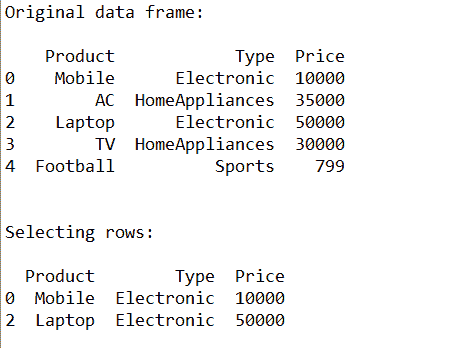
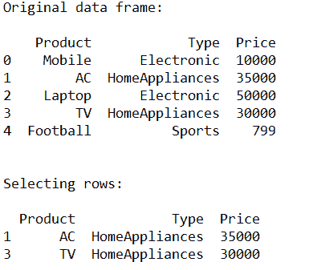
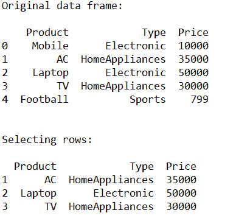
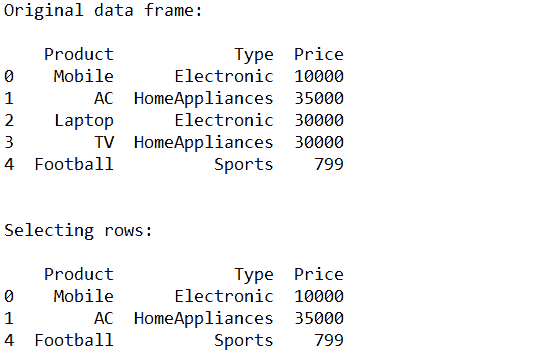

# 如何从熊猫数据框中选择行？

> 原文:[https://www . geesforgeks . org/如何从熊猫数据框中选择行/](https://www.geeksforgeeks.org/how-to-select-rows-from-pandas-dataframe/)

`pandas.DataFrame.loc`是根据提供的条件从熊猫数据框中选择行的函数。在本文中，让我们学习根据一些条件从熊猫数据框中选择行。

> **语法:**df . loc[df[' cname ']' condition ']
> 
> **参数:**
> **df:** 代表数据框
> **cname:** 代表列名
> **条件:**代表必须选择行的条件

**例 1:**

```
# Importing pandas as pd
from pandas import DataFrame

# Creating a data frame
cart = {'Product': ['Mobile', 'AC', 'Laptop', 'TV', 'Football'],
        'Type': ['Electronic', 'HomeAppliances', 'Electronic', 
                 'HomeAppliances', 'Sports'],
        'Price': [10000, 35000, 50000, 30000, 799]
       }

df = DataFrame(cart, columns = ['Product', 'Type', 'Price'])

# Print original data frame
print("Original data frame:\n")
print(df)

# Selecting the product of Electronic Type
select_prod = df.loc[df['Type'] == 'Electronic']

print("\n")

# Print selected rows based on the condition
print("Selecting rows:\n")
print (select_prod)
```

**产量:**T2T4**例 2:**

```
# Importing pandas as pd
from pandas import DataFrame

# Creating a data frame
cart = {'Product': ['Mobile', 'AC', 'Laptop', 'TV', 'Football'],
        'Type': ['Electronic', 'HomeAppliances', 'Electronic',
                 'HomeAppliances', 'Sports'],
        'Price': [10000, 35000, 50000, 30000, 799]
       }

df = DataFrame(cart, columns = ['Product', 'Type', 'Price'])

# Print original data frame
print("Original data frame:\n")
print(df)

# Selecting the product of HomeAppliances Type
select_prod = df.loc[df['Type'] == 'HomeAppliances']

print("\n")

# Print selected rows based on the condition
print("Selecting rows:\n")
print (select_prod)
```

**输出:**

**例 3:**

```
# Importing pandas as pd
from pandas import DataFrame

# Creating a data frame
cart = {'Product': ['Mobile', 'AC', 'Laptop', 'TV', 'Football'],
        'Type': ['Electronic', 'HomeAppliances', 'Electronic',
                 'HomeAppliances', 'Sports'],
        'Price': [10000, 35000, 50000, 30000, 799]
       }

df = DataFrame(cart, columns = ['Product', 'Type', 'Price'])

# Print original data frame
print("Original data frame:\n")
print(df)

# Selecting the product of Price greater 
# than or equal to 25000
select_prod = df.loc[df['Price'] >= 25000]

print("\n")

# Print selected rows based on the condition
print("Selecting rows:\n")
print (select_prod)
```

**输出:**

**例 4:**

```
# Importing pandas as pd
from pandas import DataFrame

# Creating a data frame
cart = {'Product': ['Mobile', 'AC', 'Laptop', 'TV', 'Football'],
        'Type': ['Electronic', 'HomeAppliances', 'Electronic',
                 'HomeAppliances', 'Sports'],
        'Price': [10000, 35000, 30000, 30000, 799]
       }

df = DataFrame(cart, columns = ['Product', 'Type', 'Price'])

# Print original data frame
print("Original data frame:\n")
print(df)

# Selecting the product of Price not 
# equal to 30000
select_prod = df.loc[df['Price'] != 30000]

print("\n")

# Print selected rows based on the condition
print("Selecting rows:\n")
print (select_prod)
```

**输出:**
