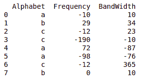
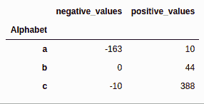
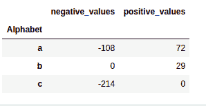

# 熊猫中如何使用 GroupBy 对负值和正值求和？

> 原文:[https://www . geesforgeks . org/如何使用熊猫中的 groupby 对负值和正值求和/](https://www.geeksforgeeks.org/how-to-sum-negative-and-positive-values-using-groupby-in-pandas/)

在本文中，我们将讨论如何在熊猫中使用 GroupBy 方法计算数据帧中所有负数和正数的总和。

要使用 **groupby()** 方法，请使用下面给出的语法。

> ***语法:*** df.groupby(column_name)

### 逐步实施

**步骤 1:** 创建 lambda 函数来计算正和与负和值。

```
pos = lambda col : col[col > 0].sum()
neg = lambda col : col[col < 0].sum()
```

**第二步:**我们将使用 groupby()方法，并应用 lambda 函数来计算总和。

```
d = df.groupby(df['Alphabet'])
print(d['Frequency'].agg([('negative_values', neg),
                         ('positive_values', pos)
                         ]))
print(d['Bandwidth'].agg([('negative_values', neg),
                         ('positive_values', pos)
                         ]))
```

### 例子

**例 1:**

计算两列的 a、b、c 的所有正值和负值之和，即频率和带宽

## 蟒蛇 3

```
# Import Necessary Libraries
import pandas as pd
import numpy as np

# Creating a DataFrame with 
# random values
df = pd.DataFrame({'Alphabet': ['a', 'b', 'c', 'c',
                                'a', 'a', 'c', 'b'],

                   'Frequency': [-10, 29, -12, -190,
                                 72, -98, -12, 0],

                   'BandWidth': [10, 34, 23, -10, -87,
                                 -76, 365, 10]})

print(df)

# Group By dataframe on categorical
# values
d = df.groupby(df['Alphabet'])

# creating lambda function to calculate
# positive as well as negative values
def pos(col): 
  return col[col > 0].sum()

def neg(col): 
  return col[col < 0].sum()

# Apply lambda function to particular 
# column
print(d['Frequency'].agg([('negative_values', neg),
                          ('positive_values', pos)
                          ]))

print(d['Bandwidth'].agg([('negative_values', neg),
                          ('positive_values', pos)
                          ]))
```

**输出:**

  

**例 2:**

计算两列(即 X 和 Y)的 a、b 的所有正值和负值之和

## 蟒蛇 3

```
# Import Necessary Libraries
import pandas as pd
import numpy as np

# Creating a DataFrame with random values
df = pd.DataFrame({'Function': ['F(x)', 'F(x)', 'F(y)',
                                'F(x)', 'F(y)', 'F(x)',
                                'F(x)', 'F(y)'],

                   'X': [-10, 29, -12, -190, 72, -98,
                         -12, 0],

                   'Y': [10, 34, 23, -10, -87, -76, 
                         365, 10]})

print(df)

# Group By dataframe on categorical values
d = df.groupby(df['Function'])

# creating lambda function to calculate
# positive as well as negative values
def pos(col): 
  return col[col > 0].sum()

def neg(col): 
  return col[col < 0].sum()

# Apply lambda function to particular 
# column
print(d['X'].agg([('negative_values', neg),
                  ('positive_values', pos)
                  ]))

print(d['Y'].agg([('negative_values', neg),
                  ('positive_values', pos)
                  ]))
```

**输出:**


数据帧


十、输出


y 输出

**例 3:**

计算每个姓名(即标记)的所有正值和负值的总和。下一步是让 lambda 函数计算总和。在最后一步中，我们将根据名称对数据进行分组，并调用 lambda 函数来计算这些值的总和。

## 蟒蛇 3

```
# Import Necessary Libraries
import pandas as pd
import numpy as np

# Creating a DataFrame with random values
df = pd.DataFrame({'Name': ['Aryan', 'Nityaa', 'Dhruv',
                            'Dhruv', 'Nityaa', 'Aryan',
                            'Nityaa', 'Aryan', 'Aryan', 
                            'Dhruv', 'Nityaa', 'Dhruv', 
                            'Dhruv'],
                   'Marks': [90, 93, 78, 56, 34, 12, 67, 
                             45, 78, 92, 29, 88, 81]})
print(df)

# Group By dataframe on categorical values
d = df.groupby(df['Name'])

# creating lambda function to calculate
# positive as well as negative values
def pos(col): 
  return col[col > 0].sum()

def neg(col): 
  return col[col < 0].sum()

# Apply lambda function to particular
# column
print(d['Marks'].agg([('negative_values', neg),
                      ('positive_values', pos)
                      ]))
```

**输出:**


名称


马克斯（英格兰人姓氏）