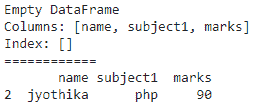

# 熊猫如何使用“不在”滤镜？

> 原文:[https://www . geeksforgeeks . org/熊猫不在过滤器中的使用方法/](https://www.geeksforgeeks.org/how-to-use-not-in-filter-in-pandas/)

在本文中，我们将讨论熊猫中的 NOT IN 过滤器，NOT IN 是一个成员操作符，用于检查数据帧中是否存在数据。如果该值不存在，它将返回 true，否则返回 false

### 让我们创建一个示例数据帧

## 蟒蛇 3

```py
# import pandas module
import pandas as pd

# create dataframe
data1 = pd.DataFrame({'name': ['sravan', 'harsha', 'jyothika'],
                      'subject1': ['python', 'R', 'php'],
                      'marks': [96, 89, 90]}, index=[0, 1, 2])

# display
data1
```

**输出:**


样本数据帧

## 方法 1:使用一列不在过滤器中

我们使用 [isin()](https://www.geeksforgeeks.org/python-pandas-dataframe-isin/) 运算符来获取数据框中的给定值，这些值取自列表，因此我们过滤数据框中该列表中存在的一列值。

> **语法**:data frame[~ data frame[column _ name]。isin(列表)]
> 
> **其中**
> 
> *   数据帧是输入数据帧
> *   column_name 是被筛选的列
> *   list 是该列中要删除的值的列表

## 蟒蛇 3

```py
# import pandas module
import pandas as pd

# create dataframe
data1 = pd.DataFrame({'name': ['sravan', 'harsha', 'jyothika'],
                      'subject1': ['python', 'R', 'php'],
                      'marks': [96, 89, 90]}, index=[0, 1, 2])

# consider a list
list1 = ['harsha', 'jyothika']

# filter in name column
print(data1[~data1['name'].isin(list1)])
print("============")

# consider a list
list2 = ['R']

# filter in name column
print(data1[~data1['subject1'].isin(list2)])
print("============")

# consider a list
list3 = [96, 89]

# filter in name column
print(data1[~data1['marks'].isin(list3)])
```

**输出:**


不在一列过滤器中

## 方法 2:在多列过滤器中使用非输入

现在，我们可以使用任意()函数在多个列中进行筛选。此函数将检查存在于任何给定列中的值，列以逗号分隔的[[]]给出。

> **语法**:数据帧[~数据帧[[列]]。isin(列表)。任意(轴=1)]

## 蟒蛇 3

```py
# import pandas module
import pandas as pd

# create dataframe
data1 = pd.DataFrame({'name': ['sravan', 'harsha', 'jyothika'],
                      'subject1': ['python', 'R', 'php'],
                      'marks': [96, 89, 90]}, index=[0, 1, 2])

# consider a list
list1 = ['harsha', 'jyothika', 96]

# filter in name and marks column
print(data1[~data1[['name', 'marks']].isin(list1).any(axis=1)])
print("============")

# consider a list
list2 = ['R', 'sravan']

# filter in name and subject1 column
print(data1[~data1[['subject1', 'name']].isin(list2).any(axis=1)])
```

**输出:**



不在多列过滤器中

## 方法 3:使用带非输入过滤器的数字

这类似于上述功能。

> **语法:**数据帧[~numpy.isin(数据帧['列']，列表)]

## 蟒蛇 3

```py
# import pandas module
import numpy as np
import pandas as pd

# create dataframe
data1 = pd.DataFrame({'name': ['sravan', 'harsha', 'jyothika'],
                      'subject1': ['python', 'R', 'php'],
                      'marks': [96, 89, 90]}, index=[0, 1, 2])

# consider a list
list1 = ['harsha', 'jyothika', 96]

# filter in name column
data1[~np.isin(data1['name'], list1)]
```

**输出:**


带不在过滤器的数字