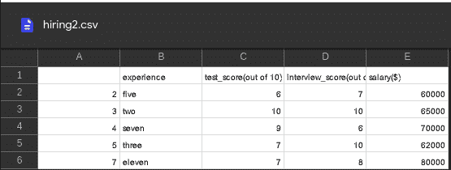
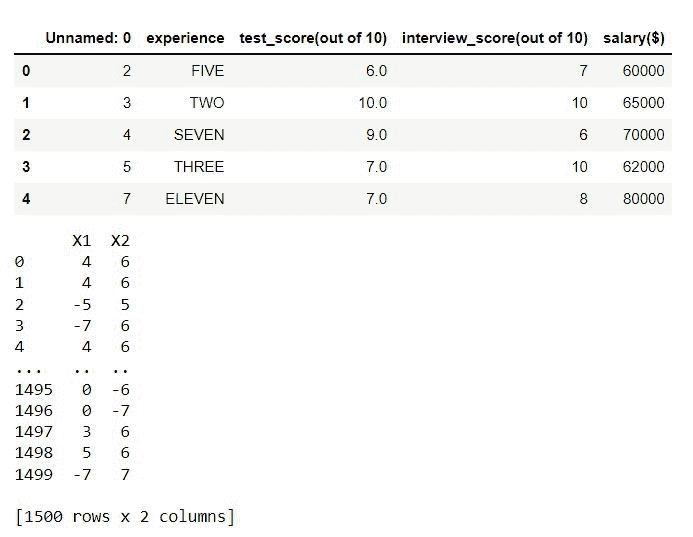
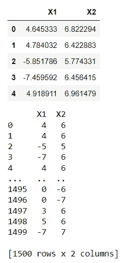

# 如何用熊猫在原地敷()呢？

> 原文:[https://www . geesforgeks . org/使用方法-熊猫-应用-inplace/](https://www.geeksforgeeks.org/how-to-use-pandas-apply-inplace/)

在本文中，我们将看到如何在 Python 中使用 [Pandas apply()](https://www.geeksforgeeks.org/python-pandas-apply/) 代替。

在 Python 中，这个函数相当于 [map()](https://www.geeksforgeeks.org/python-map-function/) 函数。它将一个函数作为输入，并将其作为一个整体应用于数据帧。如果您处理的是表格形式的数据，您需要选择函数应该作用于哪个轴(列为 0；行为 1)。

## pandas apply()方法有一个内部参数吗？

不，apply()方法不包含 inplace 参数，不像这些 pandas 方法有 inplace 参数:

*   df.drop()
*   重命名(原地=真)
*   菲尔娜()
*   dropna()
*   sort_values()
*   重置 _ 索引()
*   排序索引()
*   重命名()

## inplace 参数实际上是什么意思？

当 inplace = True 时，数据被就地编辑，这意味着它将不返回任何内容，并且数据框将被更新。当 inplace = False(默认值)时，将执行操作并返回对象的副本。

### 示例 1:在一列的位置应用()

在下面的代码中。我们首先导入熊猫包，并使用 [pd.read_csv()](https://www.geeksforgeeks.org/python-read-csv-using-pandas-read_csv/) 导入我们的 CSV 文件。导入后，我们在数据框的“experience”列上使用 apply 函数。我们将该列的字符串转换为大写。

**使用的 CSV 文件:**



## 蟒蛇 3

```
# code
import pandas as pd

# importing our dataset
df = pd.read_csv('hiring.csv')
# viewing the dataFrame
print(df)

# we change the case of all the strings
# in experience column to uppercase
df['experience'] = df['experience'].apply(str.upper)

# viewing the modified column
print(df['experience'])
```

**输出:**


```
0      FIVE
1       TWO
2     SEVEN
3     THREE
4    ELEVEN
Name: experience, dtype: object
```

### 示例 2:在多个列的位置应用()

在本例中，我们对多列使用 apply()方法。我们将列的数据类型从 float 更改为 int。用过的 CSV 文件点击[这里](https://drive.google.com/file/d/1KOsMQqDezvQCrIAG-8R_RDXcBmpmTrEU/view?usp=sharing)。

## 蟒蛇 3

```
import pandas as pd
import numpy as np

# importing our dataset
data = pd.read_csv('cluster_blobs.csv')

# viewing the dataFrame
print(df)

# we convert the datatype of columns from float to int.
data[['X1', 'X2']] = data[['X1', 'X2']].apply(np.int64)

# viewing the modified column
print(data[['X1', 'X2']])
```

**输出:**



### 示例 3:对所有列就地应用()。

在本例中，我们使用了与之前相同的 CSV 文件。这里我们对整个数据帧使用 apply()方法。我们将列的数据类型从 float 更改为 int。

## 蟒蛇 3

```
import pandas as pd
import numpy as np

# importing our dataset
data = pd.read_csv('cluster_blobs.csv')

# viewing the dataFrame
print(data)

# we convert the datatype of
# columns from float to int.
data = data.apply(np.int64)

# viewing the modified column
print(data)
```

**输出:**

