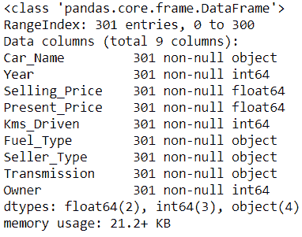

# 熊猫 cut()和 qcut()怎么用？

> 原文:[https://www . geeksforgeeks . org/如何使用-熊猫-切割和-qcut/](https://www.geeksforgeeks.org/how-to-use-pandas-cut-and-qcut/)

[**【熊猫】**](https://www.geeksforgeeks.org/introduction-to-pandas-in-python/) 是一个开源库，主要是为了轻松直观地处理关系数据或标签数据而开发的。它提供各种数据结构和操作来处理数字数据和时间序列。

在本教程中，我们将看看熊猫的智能切割和 qcut 功能。基本上，我们使用 cut 和 qcut 将一个数值列转换成一个分类列，也许是为了使它更适合机器学习模型(在数值列相当倾斜的情况下)，或者只是为了更好地分析手头的数据。现在，与其脱口而出 cut 和 qcut 的技术定义，我们不如看看这两个函数擅长什么以及如何使用它们。

我们将首先导入必要的数据操作库。

## 蟒蛇 3

```py
import pandas as pd
import numpy as np
import matplotlib.pyplot as plt
```

我们将使用 CarDekho 数据集，其中包含平台上列出的二手车数据。您可以在这里找到数据集[:](https://www.kaggle.com/nehalbirla/vehicle-dataset-from-cardekho)

*   “年份”是购买汽车的年份。
*   “售价”是车主想要出售汽车的价格。
*   ‘present _ Price’是该车目前的前展厅价格。
*   “车主”定义的是在这辆车被放到平台上之前，这辆车的车主人数。

其余的列都是不言自明的。

## 蟒蛇 3

```py
df = pd.read_csv('cardekho.csv')
df.head()
```

**输出:**


## 蟒蛇 3

```py
# no missing values in the dataset
df.info()
```



我们将注入一个缺失值，以更好地展示 cut 和 qcut 如何处理“不完美”的数据集。

## 蟒蛇 3

```py
df.loc[0, 'Year'] = np.nan

# these are the 'unique' years in
# the data
np.array(sorted(df.Year.unique()))
```

**输出:**


## pd.cut()

我们可以通过两种方式使用“剪切”功能:直接指定箱子的数量，让熊猫为我们计算相等大小的箱子，或者我们可以根据需要手动指定箱子的边缘。

## 蟒蛇 3

```py
# right = True, by default
pd.cut(df.Year, bins=3, right=True).head()
```

**输出:**


当我们指定 bins = 3 时，熊猫看到数据中的年份范围是 2003 年到 2018 年，因此适当地将其切成 3 个等宽的各 5 年的 bin:[(2002.985，2008.0] < (2008.0, 2013.0] < (2013.0, 2018.0]. Note that pandas automatically took the lower bound value of the the first category (2002.985) to be a fraction less that the least value in the ‘Year’ column (2003), to include the year 2003 in the results as well, because you see, the lower bounds of the bins are open ended, while the upper bounds are closed ended (as right=True)

**注意:** 你有没有注意到 NaN 值在输出结果中也是作为 NaN 保存的？当我们指定 right=False 时，左边界现在是封闭的，而右边界是开放的。

## 蟒蛇 3

```py
pd.cut(df.Year, bins=3, right=False).head()
```