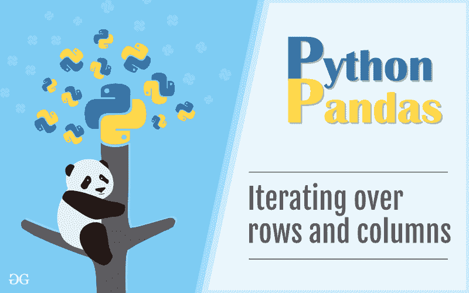
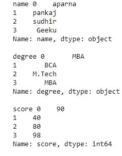
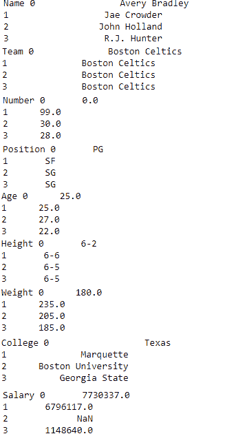

# 迭代熊猫数据框中的行和列

> 原文:[https://www . geesforgeks . org/iterating-over-row-and-columns-in-pandas-data frame/](https://www.geeksforgeeks.org/iterating-over-rows-and-columns-in-pandas-dataframe/)

迭代是一个通用术语，指的是一个接一个地获取事物的每一项。熊猫数据帧由行和列组成，所以为了迭代数据帧，我们必须像字典一样迭代数据帧。在字典中，我们迭代对象的键，就像在 dataframe 中迭代一样。



本文中，我们是用“nba.csv”文件下载的 csv，点击[这里](https://media.geeksforgeeks.org/wp-content/uploads/nba.csv)。
在熊猫数据框中，我们可以用两种方式迭代一个元素:

*   遍历行
*   在列上迭代

### 遍历行:

为了遍历行，我们可以使用三个函数 iteritems()，iterrows()，over 元组()。这三个函数将有助于对行进行迭代。

#### 使用 iterrows()对行进行迭代

为了遍历行，我们应用 iterrows()函数，该函数返回每个索引值以及包含每行数据的序列。

**代码#1:**

## 蟒蛇 3

```py
# importing pandas as pd
import pandas as pd

# dictionary of lists
dict = {'name':["aparna", "pankaj", "sudhir", "Geeku"],
        'degree': ["MBA", "BCA", "M.Tech", "MBA"],
        'score':[90, 40, 80, 98]}

# creating a dataframe from a dictionary
df = pd.DataFrame(dict)

print(df)
```


现在我们应用 iterrows()函数来获取行的每个元素。

## 蟒蛇 3

```py
# importing pandas as pd
import pandas as pd

# dictionary of lists
dict = {'name':["aparna", "pankaj", "sudhir", "Geeku"],
        'degree': ["MBA", "BCA", "M.Tech", "MBA"],
        'score':[90, 40, 80, 98]}

# creating a dataframe from a dictionary
df = pd.DataFrame(dict)

# iterating over rows using iterrows() function
for i, j in df.iterrows():
    print(i, j)
    print()
```

**输出:**


**代码#2:**

## 计算机编程语言

```py
# importing pandas module
import pandas as pd

# making data frame from csv file
data = pd.read_csv("nba.csv")

# for data visualization we filter first 3 datasets
data.head(3)
```


现在我们应用一个 iterrows 来获取 dataframe 中每一行的柠檬

## 计算机编程语言

```py
# importing pandas module
import pandas as pd

# making data frame from csv file
data = pd.read_csv("nba.csv")

for i, j in data.iterrows():
    print(i, j)
    print()
```

**输出:**


#### 使用 over()对行进行迭代

为了遍历行，我们使用 iteritems()函数该函数遍历每个列作为键，以标签作为键的值对，以及作为 Series 对象的列值。

**代码#1:**

## 蟒蛇 3

```py
# importing pandas as pd
import pandas as pd

# dictionary of lists
dict = {'name':["aparna", "pankaj", "sudhir", "Geeku"],
        'degree': ["MBA", "BCA", "M.Tech", "MBA"],
        'score':[90, 40, 80, 98]}

# creating a dataframe from a dictionary
df = pd.DataFrame(dict)

print(df)
```


现在我们应用 iteritems()函数来检索 dataframe 的行。

## 蟒蛇 3

```py
# importing pandas as pd
import pandas as pd

# dictionary of lists
dict = {'name':["aparna", "pankaj", "sudhir", "Geeku"],
        'degree': ["MBA", "BCA", "M.Tech", "MBA"],
        'score':[90, 40, 80, 98]}

# creating a dataframe from a dictionary
df = pd.DataFrame(dict)

# using iteritems() function to retrieve rows
for key, value in df.iteritems():
    print(key, value)
    print()
```

**输出:**



**代码#2:**

## 计算机编程语言

```py
# importing pandas module
import pandas as pd

# making data frame from csv file
data = pd.read_csv("nba.csv")

# for data visualization we filter first 3 datasets
data.head(3)
```

**输出:**


现在，我们应用 item()从数据框中检索行

## 计算机编程语言

```py
# importing pandas module
import pandas as pd

# making data frame from csv file
data = pd.read_csv("nba.csv")

for key, value in data.iteritems():
    print(key, value)
    print()
```

**输出:**



#### 使用 over 元组对行进行迭代()

为了遍历行，我们应用一个函数 itertuples()，这个函数为数据帧中的每一行返回一个 tuple。元组的第一个元素将是行的对应索引值，而其余的值是行值。

**代码#1:**

## 蟒蛇 3

```py
# importing pandas as pd
import pandas as pd

# dictionary of lists
dict = {'name':["aparna", "pankaj", "sudhir", "Geeku"],
        'degree': ["MBA", "BCA", "M.Tech", "MBA"],
        'score':[90, 40, 80, 98]}

# creating a dataframe from a dictionary
df = pd.DataFrame(dict)

print(df)
```


现在，我们应用 ITER 元组()函数来获取每行的元组

## 蟒蛇 3

```py
# importing pandas as pd
import pandas as pd

# dictionary of lists
dict = {'name':["aparna", "pankaj", "sudhir", "Geeku"],
        'degree': ["MBA", "BCA", "M.Tech", "MBA"],
        'score':[90, 40, 80, 98]}

# creating a dataframe from dictionary
df = pd.DataFrame(dict)

# using a itertuples()
for i in df.itertuples():
    print(i)
```

**输出:**


**代码#2:**

## 计算机编程语言

```py
# importing pandas module
import pandas as pd

# making data frame from csv file
data = pd.read_csv("nba.csv")

# for data visualization we filter first 3 datasets
data.head(3)
```


现在，我们应用 ITER 元组()来获取每一行的一个实例

## 计算机编程语言

```py
# importing pandas module
import pandas as pd

# making data frame from csv file
data = pd.read_csv("nba.csv")

for i in data.itertuples():
    print(i)
```

**输出:**


### 在列上迭代:

为了遍历列，我们需要创建一个 dataframe 列列表，然后遍历该列表以拉出 dataframe 列。

**代码#1:**

## 蟒蛇 3

```py
# importing pandas as pd
import pandas as pd

# dictionary of lists
dict = {'name':["aparna", "pankaj", "sudhir", "Geeku"],
        'degree': ["MBA", "BCA", "M.Tech", "MBA"],
        'score':[90, 40, 80, 98]}

# creating a dataframe from a dictionary
df = pd.DataFrame(dict)

print(df)
```


现在我们遍历列为了遍历列，我们首先创建一个 dataframe 列的列表，然后遍历列表。

## 计算机编程语言

```py
# creating a list of dataframe columns
columns = list(df)

for i in columns:

    # printing the third element of the column
    print (df[i][2])
```

**输出:**


**代码#2:**

## 计算机编程语言

```py
# importing pandas module
import pandas as pd

# making data frame from csv file
data = pd.read_csv("nba.csv")

# for data visualization we filter first 3 datasets
 col = data.head(3)

col
```


现在我们迭代 CSV 文件中的列，为了迭代列，我们创建一个数据框列列表，并迭代列表

## 计算机编程语言

```py
# creating a list of dataframe columns
clmn = list(col)

for i in clmn:
    # printing a third element of column
    print(col[i][2])
```

**输出:**

