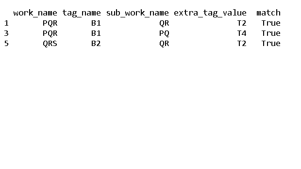

# 通过子串

连接熊猫数据帧匹配

> 原文:[https://www . geesforgeks . org/join-pandas-data frames-按子字符串匹配/](https://www.geeksforgeeks.org/join-pandas-dataframes-matching-by-substring/)

**先决条件:**T2】熊猫

在本文中，我们将学习如何使用 python 连接两个通过子字符串匹配的数据框。

### **使用的功能:**

*   [**【join()】**](https://www.geeksforgeeks.org/join-function-python/)**:**将迭代中的所有元素连接成单个字符串
*   [**【lambda(**](https://www.geeksforgeeks.org/python-lambda/)**):**一个匿名方法，声明时没有名字，可以接受任意数量的参数
*   [**【find()**](https://www.geeksforgeeks.org/python-string-find/#:~:text=The%20find()%20method%20returns,found%20then%20it%20returns%20%2D1.)**:**获得任何必备值的初始外观
*   [**合并()**](https://www.geeksforgeeks.org/python-pandas-merging-joining-and-concatenating/) :合并两个数据帧

### **接近**

按照以下步骤连接由子字符串匹配的两个数据帧。

*   创建两个数据帧。
*   使用笛卡尔乘积连接两个数据帧
*   在所有数据框中加入包含相等值的重复列
*   加入新的专栏
*   最后，删除每个数据框中添加的列。
*   然后，我们需要向数据框中添加一个新列。为此，我们将使用“lambda”和“find”函数，其中输出大于零。
*   现在，我们打印由子字符串匹配的连接数据帧。

**下面是实现。**

## 蟒蛇 3

```py
import pandas as pd

dataFrame1 = pd.DataFrame([['PQR', 'B1'], ['QRS', 'B2'], ['RDE', 'B3']], 
                          columns=['work_name', 'tag_name'])

dataFrame2 = pd.DataFrame([['RR', 'T1'], ['QR', 'T2'], ['HG', 'T3'], 
                           ['PQ', 'T4']],
                          columns=['sub_work_name', 'extra_tag_value'])

dataFrame1['join'] = 1
dataFrame2['join'] = 1

dataFrameFull = dataFrame1.merge(
  dataFrame2, on='join').drop('join', axis=1)

dataFrame2.drop('join', axis=1, inplace=True)

dataFrameFull['match'] = dataFrameFull.apply(
    lambda x: x.work_name.find(x.sub_work_name), axis=1).ge(0)

print(dataFrameFull[dataFrameFull['match']])
```

**输出:**

