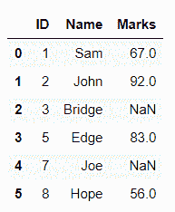

# 通过匹配的身份证号

合并两个熊猫数据帧

> 原文:[https://www . geesforgeks . org/merge-two-pandas-data frames-by-matched-id-number/](https://www.geeksforgeeks.org/merge-two-pandas-dataframes-by-matched-id-number/)

在本文中，我们将看到如何基于匹配的标识号合并两个数据帧。

**接近**

*   创建第一数据帧
*   创建第二个数据框
*   选择要匹配的列
*   使用合并功能进行合并

> ***语法:**数据帧合并(参数)*

*   显示结果

下面给出了通过使用具有适当值的所需参数来产生所需结果的实现。

**示例:**

## 蟒蛇 3

```py
# import pandas as pd
import pandas as pd

# creating dataframes as df1 and df2
df1 = pd.DataFrame({'ID': [1, 2, 3, 5, 7, 8], 
                    'Name': ['Sam', 'John', 'Bridge',
                             'Edge', 'Joe', 'Hope']})

df2 = pd.DataFrame({'ID': [1, 2, 4, 5, 6, 8, 9],
                    'Marks': [67, 92, 75, 83, 69, 56, 81]})

# merging df1 and df2 by ID
# i.e. the rows with common ID's get
# merged i.e. {1,2,5,8}
df = pd.merge(df1, df2, on="ID")
print(df)
```

**输出:**


合并的数据帧

合并两个带有标识列的数据框，所有标识都在左侧数据框中，即合并函数的第一个参数。df2 中不存在的标识为该行的列获取一个 NaN 值。

**例 2 :**

## 蟒蛇 3

```py
# import pandas as pd
import pandas as pd

# creating dataframes as df1 and df2
df1 = pd.DataFrame({'ID': [1, 2, 3, 5, 7, 8], 
                    'Name': ['Sam', 'John', 'Bridge',
                             'Edge', 'Joe', 'Hope']})

df2 = pd.DataFrame({'ID': [1, 2, 4, 5, 6, 8, 9],
                    'Marks': [67, 92, 75, 83, 69, 56, 81]})

# merging df1 and df2 by ID
# i.e. the rows with common ID's get merged
# with all the ID's of left dataframe i.e. df1
# and NaN for columns of df2 where ID do not match
df = pd.merge(df1, df2, on="ID", how="left")
print(df)
```

**输出:**



合并的数据帧

合并两个带有标识列的数据框，所有标识都在右边的数据框中，即合并函数的第二个参数。与 df1 不匹配的标识将获得该列的 NaN 值。

**例 3 :**

## 蟒蛇 3

```py
# import pandas as pd
import pandas as pd

# creating dataframes as df1 and df2
df1 = pd.DataFrame({'ID': [1, 2, 3, 5, 7, 8], 
                    'Name': ['Sam', 'John', 'Bridge', 
                             'Edge', 'Joe', 'Hope']})

df2 = pd.DataFrame({'ID': [1, 2, 4, 5, 6, 8, 9],
                    'Marks': [67, 92, 75, 83, 69, 56, 81]})

# merging df1 and df2 by ID
# i.e. the rows with common ID's get merged
# with all the ID's of right dataframe i.e. df2
# and NaN values for df1 columns where ID do not match
df = pd.merge(df1, df2, on="ID", how="right")
print(df)
```

**输出:**


合并的数据帧

合并两个具有标识列的数据帧，两个数据帧中所有匹配的数据帧。

**例 4 :**

## 蟒蛇 3

```py
# import pandas as pd
import pandas as pd

# creating dataframes as df1 and df2
df1 = pd.DataFrame({'ID': [1, 2, 3, 5, 7, 8],
                    'Name': ['Sam', 'John', 'Bridge',
                             'Edge', 'Joe', 'Hope']})

df2 = pd.DataFrame({'ID': [1, 2, 4, 5, 6, 8, 9],
                    'Marks': [67, 92, 75, 83, 69, 56, 81]})

# merging df1 and df2 by ID
# i.e. the rows with common ID's get merged
# with all the ID's that match in both the Dataframe
df = pd.merge(df1, df2, on="ID", how="inner")
print(df)
```

**输出:**


合并的数据帧

合并两个带有标识列的数据帧，对于在两个数据帧中都找不到标识的列，合并两个数据帧的所有标识和 NaN 值。

**例 5 :**

## 蟒蛇 3

```py
# import pandas as pd
import pandas as pd

# creating dataframes as df1 and df2
df1 = pd.DataFrame({'ID': [1, 2, 3, 5, 7, 8],
                    'Name': ['Sam', 'John', 'Bridge',
                             'Edge', 'Joe', 'Hope']})

df2 = pd.DataFrame({'ID': [1, 2, 4, 5, 6, 8, 9],
                    'Marks': [67, 92, 75, 83, 69, 56, 81]})

# merging df1 and df2 by ID
# i.e. the rows with common ID's get merged
# with all the ID's of both the dataframes
# and NaN values for the columns where the ID's 
# do not match
df = pd.merge(df1, df2, on="ID", how="outer")
print(df)
```

**输出:**


合并的数据帧