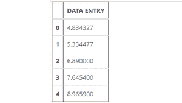
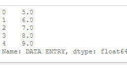
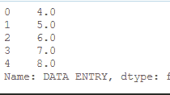

# 熊猫数据框中取整数值的方法

> 原文:[https://www . geesforgeks . org/methods-to-round-value-in-pandas-data frame/](https://www.geeksforgeeks.org/methods-to-round-values-in-pandas-dataframe/)

熊猫数据框中有各种取整数值的方法，让我们逐一看看:

让我们创建一个只有“数据输入”列的数据框:

**代码:**

## 蟒蛇 3

```py
# import Dataframe class
# from pandas library
from pandas import DataFrame

# import numpy library
import numpy as np

# dictionary
Myvalue = {'DATA ENTRY': [4.834327, 5.334477,
                          6.89, 7.6454, 8.9659]} 

# create a Dataframe
df = DataFrame(Myvalue,
               columns = ['DATA ENTRY'])

# show the dataframe
df
```

**输出:**



**方法 1:** 使用 [numpy.round()。](https://www.geeksforgeeks.org/numpy-round_-python/)

> **语法:** numpy.round_(arr，小数= 0，out =无)
> 
> **返回:**所有数组元素都被
> 舍入的数组，与输入类型相同。

此方法可用于将任何特定列的值舍入到特定的小数位数，也可用于将整个数据框的值舍入到特定的小数位数。

**示例:**将“数据输入”列的值四舍五入到小数点后两位。

## 蟒蛇 3

```py
# import Dataframe class
# from pandas library
from pandas import DataFrame

# import numpy library
import numpy as np

# dictionary
Myvalue = {'DATA ENTRY': [4.834327, 5.334477,
                          6.89, 7.6454, 8.9659]} 

# create a Dataframe
df = DataFrame(Myvalue,
               columns = ['DATA ENTRY'])

# Rounding value of 'DATA ENTRY' 
# column upto 2 decimal places
roundplaces = np.round(df['DATA ENTRY'],
                       decimals = 2) 

# show the rounded value
roundplaces
```

**输出:**


**方法二:**使用[数据框](https://www.geeksforgeeks.org/python-pandas-apply/)和 [numpy.ceil()](https://www.geeksforgeeks.org/numpy-ceil-python/) 一起应用。

> **语法:** Dataframe/Series.apply(func，convert_dtype=True，args=()
> 
> **应用功能/操作后返回:**熊猫系列。
> 
> **语法:** numpy.ceil(x[，out])= ufnc ' ceil ')
> 
> **返回**:一个数组，每个元素的上限为浮点数据类型。

这些方法用于将值舍入到最高值(大于特定值的最小整数值)。

**示例:**舍入特定列的值。

## 蟒蛇 3

```py
# import Dataframe from 
# pandas library
from pandas import DataFrame

# import numpy
import numpy as np

# dictionary
Myvalue = {'DATA ENTRY': [4.834327, 5.334477,
                          6.89, 7.6454, 8.9659]} 

# create a Dataframe
df = DataFrame(Myvalue, 
               columns = ['DATA ENTRY'])

# Here we are rounding the 
# value to its ceiling values
roundUp = df['DATA ENTRY'].apply(np.ceil) 

# show the rounded value
roundUp
```

**输出:**



**方法三:**使用[数据框](https://www.geeksforgeeks.org/python-pandas-apply/)和[数字地板](https://www.geeksforgeeks.org/numpy-floor-python/)一起使用。

> **语法** : numpy.floor(x[，out]) = ufunc 'floor ')
> 
> **返回:**每个元素所在楼层的数组。

这些方法用于将值舍入到最低值(小于特定值的最大整数值)。

**示例:**将“数据输入”列的值四舍五入到其对应的楼层值。

## 蟒蛇 3

```py
# import Dataframe class 
# from pandas library
from pandas import DataFrame

# import numpy library
import numpy as np

# dictionary
Myvalue = {'DATA ENTRY':[4.834327, 5.334477, 
                         6.89, 7.6454, 8.9659] } 
# create a Dataframe
df = DataFrame(Myvalue, 
               columns = ['DATA ENTRY']) 

# Rounding of Value to its Floor value 
rounddown = df['DATA ENTRY'].apply(np.floor)  

# show the rounded value
rounddown
```

**输出:**

