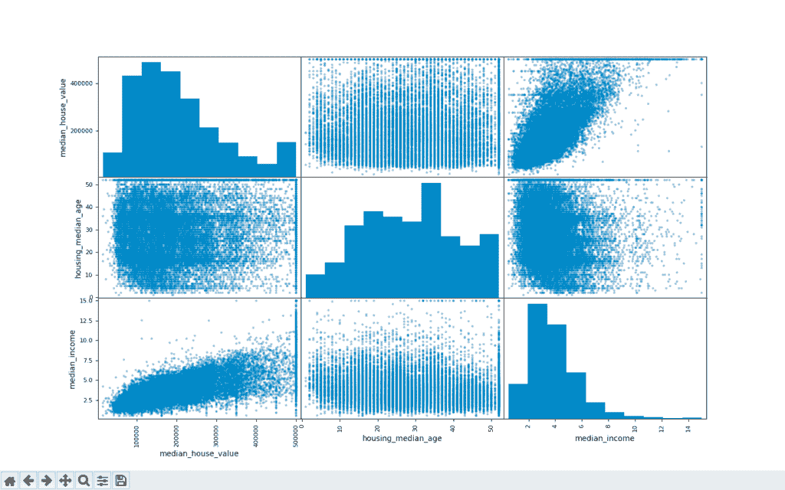

# 在熊猫中使用散布矩阵配对图

> 原文:[https://www . geeksforgeeks . org/pair-plot-使用熊猫散布矩阵/](https://www.geeksforgeeks.org/pair-plots-using-scatter-matrix-in-pandas/)

检查数据集属性之间的共线性是数据预处理中最重要的步骤之一。理解要素之间相关性的一个好方法是为每对属性创建散点图。熊猫有一个功能**散点 _ 矩阵()**，为此。*散点图矩阵()*可用于轻松生成所有数值特征对之间的一组散点图。它为每个数字特征与其他数字特征创建一个图，并为每个数字特征创建一个直方图。

> **语法:**熊猫.标绘.散点 _ 矩阵(帧)
> **参数:**
> **帧:**要标绘的数据帧。

在下面的例子中，我们将在[数据集上创建散点图。](https://drive.google.com/file/d/1i2w07jdXXLJeSNize4xszDP8GgtSqAar/view?usp=sharing)

该数据集包含价格和加州地区房屋的其他统计数据。

```
import pandas as pd

# loading the dataset
data = pd.read_csv('housing.csv')

# inspecting the data
data.info()
```

**Output :**

```

RangeIndex: 20640 entries, 0 to 20639
Data columns (total 10 columns):
 #   Column              Non-Null Count  Dtype  
---  ------              --------------  -----  
 0   longitude           20640 non-null  float64
 1   latitude            20640 non-null  float64
 2   housing_median_age  20640 non-null  float64
 3   total_rooms         20640 non-null  float64
 4   total_bedrooms      20433 non-null  float64
 5   population          20640 non-null  float64
 6   households          20640 non-null  float64
 7   median_income       20640 non-null  float64
 8   median_house_value  20640 non-null  float64
 9   ocean_proximity     20640 non-null  object 
dtypes: float64(9), object(1)
memory usage: 1.6+ MB

```

### 创建散点图

让我们选择三个数字列；*中值 _ 房价*、*住房 _ 中值 _ 年龄*、*中值 _ 收入*，用于标绘。注意熊猫地块依赖 Matplotlib，需要先导入。

```
import matplotlib.pyplot as plt
from pandas.plotting import scatter_matrix

# selecting three numerical features
features = ['median_house_value', 'housing_median_age',
            'median_income']

# plotting the scatter matrix
# with the features
scatter_matrix(data[features])
plt.show()
```

**Output :**[](https://media.geeksforgeeks.org/wp-content/uploads/20200730221426/Screenshot-2020-07-30-at-10.10.56-PM.png)

矩阵中的每个散点图都有助于我们理解相应属性对之间的相关性。我们可以看到，*收入中位数*和*房价中位数*有很强的相关性。主对角线包含每个属性的直方图。