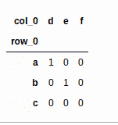

# Python 中 pandas . crosstable()函数

> 原文:[https://www . geesforgeks . org/pandas-交叉表-python 中的函数/](https://www.geeksforgeeks.org/pandas-crosstab-function-in-python/)

该方法用于计算两个(或多个)因素的简单交叉列表。默认情况下，会计算因子的频率表，除非传递了值数组和聚合函数。

> **语法:**pandas . crosstable(索引，列，值=无，行名=无，列名=无，aggfunc =无，边距=假，边距 _name= '全部'，dropna =真，normalize =假)
> 
> **论据:**
> 
> *   **索引:**类似数组、序列或数组/序列列表，行中要分组的值。
> *   **列:**类似数组、系列或数组/系列列表，列中要分组的值。
> *   **值:**类似数组，可选，数组中的值要根据因素进行聚合。要求指定“aggfunc”。
> *   **行名:**序列，默认无，如果通过，必须与通过的行数组数匹配。
> *   **列名**:序列，默认无，如果通过，必须与通过的列数组数匹配。
> *   **aggfunc :** 函数，可选，如果指定，还需要指定“值”。
> *   **边距:** bool，默认 False，添加行/列边距(小计)。
> *   **边距 _ 名称:**字符串，默认为“全部”，当边距为真时，将包含总计的行/列的名称。
> *   **dropna :** bool，默认为 True，不包括条目全部为 NaN 的列。

下面是上述方法的实现，并附有一些例子:

**例 1 :**

## 蟒蛇 3

```
# importing packages
import pandas
import numpy

# creating some data
a = numpy.array(["foo", "foo", "foo", "foo",
                 "bar", "bar", "bar", "bar",
                 "foo", "foo", "foo"],
                dtype=object)

b = numpy.array(["one", "one", "one", "two",
                 "one", "one", "one", "two",
                 "two", "two", "one"],
                dtype=object)

c = numpy.array(["dull", "dull", "shiny",
                 "dull", "dull", "shiny",
                 "shiny", "dull", "shiny",
                 "shiny", "shiny"],
                dtype=object)

# form the cross tab
pandas.crosstab(a, [b, c], rownames=['a'], colnames=['b', 'c'])
```

**输出:**


**例 2 :**

## 蟒蛇 3

```
# importing package
import pandas

# create some data
foo = pandas.Categorical(['a', 'b'], 
                         categories=['a', 'b', 'c'])

bar = pandas.Categorical(['d', 'e'], 
                         categories=['d', 'e', 'f'])

# form crosstab with dropna=True (default)
pandas.crosstab(foo, bar)

# form crosstab with dropna=False
pandas.crosstab(foo, bar, dropna=False)
```

**输出:**

