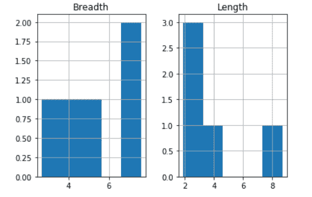
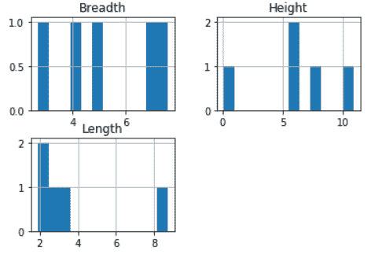
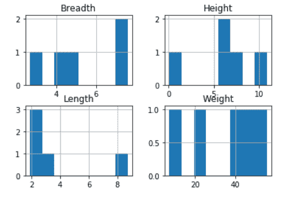

# 熊猫。Python 中的 DataFrame.hist()函数

> 原文:[https://www . geesforgeks . org/pandas-data frame-hist-function-in-python/](https://www.geeksforgeeks.org/pandas-dataframe-hist-function-in-python/)

**熊猫。DataFrame.hist()** 函数对于理解数值变量的分布很有用。该函数将值分解成数值变量。它的主要功能是制作给定数据帧的直方图。

数据的分布由**直方图**表示。当使用 Function Pandas DataFrame.hist()时，它会自动调用 DataFrame 中每个系列的函数**【matplotlib . pyplot . hist()**。结果，我们获得了每列一个直方图。

> **语法:** DataFrame.hist(数据，列=无，by =无，网格=真，xlabelsize =无，xrot =无，ylabelsize =无，yrot =无，ax =无，sharex =假，sharey =假，figsize =无，布局=无，bins = 10，后端=无，图例=假，**kwargs)
> 
> **参数:**
> 
> **数据** : DataFrame
> **列:** str 或 sequence
> **xlabelsize:**int，默认 None
> **ylabelsize:**int，默认 None
> **ax:**Matplotlib axes 对象，默认 None
> *** * kwargs**
> 所有其他绘图关键字参数都要传递给 matplotlib.pyplot.hist()。
> 
> **返回:**
> matplotlib。axessubplot 或 numpy . ndarray

**示例 1:** 创建熊猫数据帧的 **2 列**的直方图

有时我们需要绘制数据框各列的直方图，以便更深入地分析它们。在这种情况下，dataframe.hist()函数帮助很大。使用这个函数，我们可以绘制任意多列的直方图。

## 蟒蛇 3

```
# Importing pandas library
import pandas as pd

# Creating a Data frame
values = pd.DataFrame({
    'Length': [2.7, 8.7, 3.4, 2.4, 1.9],
    'Breadth': [4.24, 2.67, 7.6, 7.1, 4.9]
})

# Creating Histograms of columns 'Length'
# and 'Breadth' using Dataframe.hist()
# function
hist = values.hist(bins=5)
```

**输出:**



在上例中，我们使用 **dataframe.hist()** 函数绘制了列“**长度”**和列“**宽度”**的**直方图**。

**示例 2:** 创建熊猫数据帧的 **3 列**的直方图

## 蟒蛇 3

```
# Importing pandas library
import pandas as pd

# Creating a Data frame
values = pd.DataFrame({
    'Length': [2.7, 8.7, 3.4, 2.4, 1.9],
    'Breadth': [4.24, 2.67, 7.6, 7.1, 4.9],
    'Height': [5.8, 5.5, 7.8, 10.88, 0.1]})

# Creating Histograms of columns 'Length', 
# 'Breadth' and 'Height' using Dataframe.hist()
# function
hist = values.hist(bins=12)
```

**输出:**



在上例中，我们使用 **dataframe.hist()函数绘制了**【长度】****宽度**和**高度**列的**直方图**。**

**示例 3:** 创建熊猫数据帧的 **4 列**的直方图

## 蟒蛇 3

```
# Importing pandas library
import pandas as pd

# Creating a Data frame
values = pd.DataFrame({
    'Length': [2.7, 8.7, 3.4, 2.4, 1.9],
    'Breadth': [4.24, 2.67, 7.6, 7.1, 4.9],
    'Height': [5.8, 5.5, 7.8, 10.88, 0.1],
    'Weight': [20, 40.8, 55.8, 7.2, 48]
})

# Creating Histograms of columns 'Length',
# 'Breadth', 'Height' and 'Weight'
# using Dataframe.hist() function
hist = values.hist(bins=8)
```

**输出:**



在上例中，我们使用 **dataframe.hist()** 函数绘制了列“**长度**”、“**宽度**”、“**高度**和“**重量”**的**直方图。**