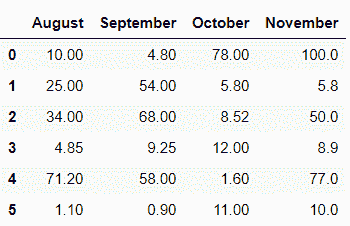

# 熊猫。Python 中的 DataFrame.T()函数

> 原文:[https://www . geesforgeks . org/pandas-data frame-t-function-in-python/](https://www.geeksforgeeks.org/pandas-dataframe-t-function-in-python/)

**熊猫。数据框**属性用于转置数据框的索引和列。属性 T 不知何故与方法**转置()有关。**该属性的主要功能是通过将行作为列来创建主对角线上数据帧的反射，反之亦然。

> **语法:**数据帧。T
> 
> **参数:**
> **复制:**如果为真，复制底层数据，否则(默认)。
> ***args，**kwargs:** 附加关键词
> 
> **返回:**转置的数据帧

**例 1:**

有时我们需要转置数据帧，以便更准确地研究它。在这种情况下**熊猫。数据框**属性起着重要的作用。

## 蟒蛇 3

```
# Importing pandas module
import pandas as pd

# Creating a dictionary
dit = {'August': [10, 25, 34, 4.85, 71.2, 1.1],
       'September': [4.8, 54, 68, 9.25, 58, 0.9],
       'October': [78, 5.8, 8.52, 12, 1.6, 11],
       'November': [100, 5.8, 50, 8.9, 77, 10]}

# Converting it to data frame
df = pd.DataFrame(data=dit)

# Original DataFrame
df
```

**输出:**



调换数据帧。

## 蟒蛇 3

```
# Transposing the data frame 
# using dataframe.T property
df_trans = df.T

print("Transposed Data frame :")
df_trans
```