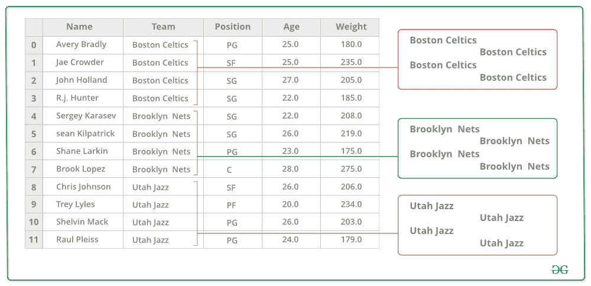
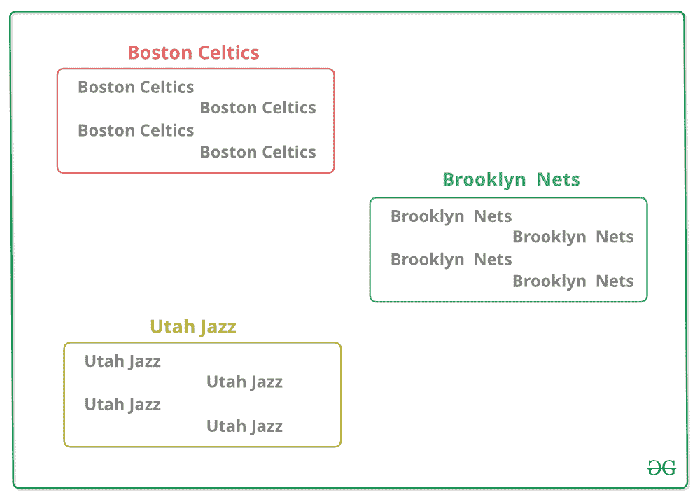
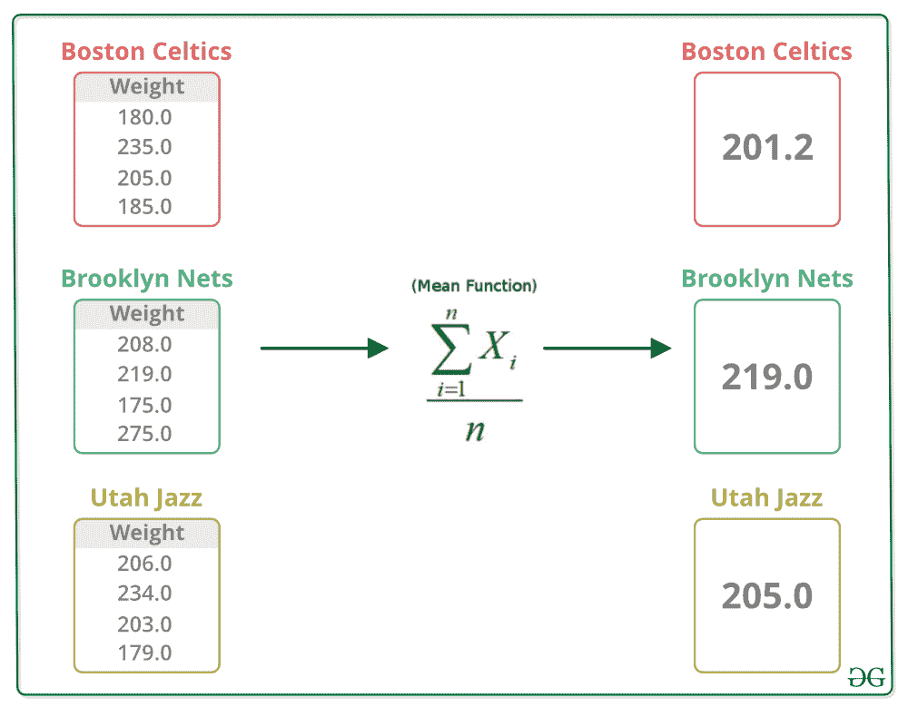
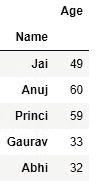
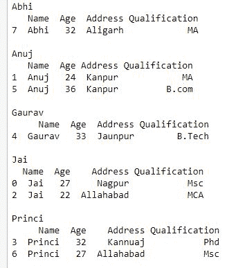
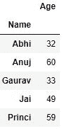
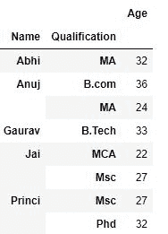
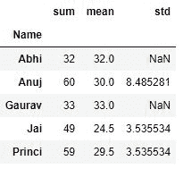
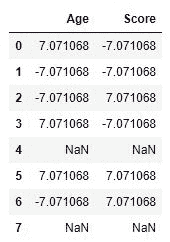

# 熊猫群由组成

> 原文:[https://www.geeksforgeeks.org/pandas-groupby/](https://www.geeksforgeeks.org/pandas-groupby/)

Groupby 是一个非常简单的概念。我们可以创建一组类别，并对这些类别应用一个函数。这是一个简单的概念，但却是一项在数据科学中广泛使用的极其有价值的技术。在真正的数据科学项目中，您将处理大量数据，并一遍又一遍地尝试，因此为了提高效率，我们使用 Groupby 概念。Groupby 概念非常重要，因为它能够高效地聚合数据，无论是性能还是代码量都非常出色。Groupby 主要指涉及以下一个或多个步骤的过程:

*   **拆分:**是我们通过对数据集应用一些条件，将数据拆分成组的过程。
*   **应用:**是我们对每组独立应用一个函数的过程
*   **合并:**是将 groupby 和结果应用到一个数据结构中后，我们合并不同数据集的过程

下图将有助于理解 Groupby 概念中涉及的流程。
1。从“团队”列
中分组唯一值

2.现在每组都有一个桶


3.将其他数据扔进水桶


4.在每个铲斗的重量栏上应用一个函数。


#### 将数据分成组

拆分是一个过程，在这个过程中，我们通过对数据集应用一些条件来将数据拆分成一个组。为了分割数据，我们对数据集应用了某些条件。为了拆分数据，我们使用`groupby()`函数该函数用于根据一些标准将数据拆分成组。熊猫的物体可以在它们的任何一个轴上分开。分组的抽象定义是提供标签到组名的映射。熊猫数据集可以分割成任何一个对象。有多种方法可以拆分数据，例如:

*   groupby 对象(关键点)
*   obj.groupby(键，轴=1)
*   obj.groupby([key1，key2])

**注:**这里我们把分组对象称为关键字。
**一键分组数据:**
为了一键分组数据，我们在`groupby`函数中只传递一个键作为参数。

```
# importing pandas module
import pandas as pd 

# Define a dictionary containing employee data 
data1 = {'Name':['Jai', 'Anuj', 'Jai', 'Princi', 
                 'Gaurav', 'Anuj', 'Princi', 'Abhi'], 
        'Age':[27, 24, 22, 32, 
               33, 36, 27, 32], 
        'Address':['Nagpur', 'Kanpur', 'Allahabad', 'Kannuaj',
                   'Jaunpur', 'Kanpur', 'Allahabad', 'Aligarh'], 
        'Qualification':['Msc', 'MA', 'MCA', 'Phd',
                         'B.Tech', 'B.com', 'Msc', 'MA']} 

# Convert the dictionary into DataFrame  
df = pd.DataFrame(data1)

print(df) 
```


现在我们使用`groupby()`功能对`Name`的数据进行分组。

```
# using groupby function
# with one key

df.groupby('Name')
print(df.groupby('Name').groups)
```

**输出:**


现在我们打印所有组中形成的第一个条目。

```
# applying groupby() function to 
# group the data on Name value. 
gk = df.groupby('Name') 

# Let's print the first entries 
# in all the groups formed. 
gk.first() 
```

**输出:**


**多键分组数据:**
为了多键分组数据，我们在`groupby`功能中传递多个键。

```
# importing pandas module
import pandas as pd 

# Define a dictionary containing employee data 
data1 = {'Name':['Jai', 'Anuj', 'Jai', 'Princi', 
                 'Gaurav', 'Anuj', 'Princi', 'Abhi'], 
        'Age':[27, 24, 22, 32, 
               33, 36, 27, 32], 
        'Address':['Nagpur', 'Kanpur', 'Allahabad', 'Kannuaj',
                   'Jaunpur', 'Kanpur', 'Allahabad', 'Aligarh'], 
        'Qualification':['Msc', 'MA', 'MCA', 'Phd',
                         'B.Tech', 'B.com', 'Msc', 'MA']} 

# Convert the dictionary into DataFrame  
df = pd.DataFrame(data1)

print(df) 
```


现在我们使用`groupby`功能中的多个键将“姓名”和“资格”的数据组合在一起。

```
# Using multiple keys in
# groupby() function
df.groupby(['Name', 'Qualification'])

print(df.groupby(['Name', 'Qualification']).groups)
```

**输出:**


**按排序键对数据进行分组:**
在 groupby 操作中，默认对组键进行排序。用户可以通过`sort=False`进行潜在加速。

```
# importing pandas module
import pandas as pd 

# Define a dictionary containing employee data 
data1 = {'Name':['Jai', 'Anuj', 'Jai', 'Princi', 
                 'Gaurav', 'Anuj', 'Princi', 'Abhi'], 
        'Age':[27, 24, 22, 32, 
               33, 36, 27, 32], } 

# Convert the dictionary into DataFrame  
df = pd.DataFrame(data1)

print(df) 
```


现在我们不排序地应用`groupby()`

```
# using groupby function
# without using sort

df.groupby(['Name']).sum()
```

**输出:**

现在我们使用排序应用`groupby()`，以获得潜在的加速

```
# using groupby function
# with sort

df.groupby(['Name'], sort = False).sum()
```

**输出:**


**用对象属性对数据进行分组:**
group 属性就像字典，其关键字是计算出的唯一组，相应的值是属于每个组的轴标签。

```
# importing pandas module
import pandas as pd 

# Define a dictionary containing employee data 
data1 = {'Name':['Jai', 'Anuj', 'Jai', 'Princi', 
                 'Gaurav', 'Anuj', 'Princi', 'Abhi'], 
        'Age':[27, 24, 22, 32, 
               33, 36, 27, 32], 
        'Address':['Nagpur', 'Kanpur', 'Allahabad', 'Kannuaj',
                   'Jaunpur', 'Kanpur', 'Allahabad', 'Aligarh'], 
        'Qualification':['Msc', 'MA', 'MCA', 'Phd',
                         'B.Tech', 'B.com', 'Msc', 'MA']} 

# Convert the dictionary into DataFrame  
df = pd.DataFrame(data1)

print(df) 
```


现在我们像在字典中使用键一样对数据进行分组。

```
# using keys for grouping
# data

df.groupby('Name').groups
```

**输出:**


#### 遍历组

为了迭代一个组元素，我们可以迭代类似于 itertools.obj 的对象。

```
# importing pandas module
import pandas as pd 

# Define a dictionary containing employee data 
data1 = {'Name':['Jai', 'Anuj', 'Jai', 'Princi', 
                 'Gaurav', 'Anuj', 'Princi', 'Abhi'], 
        'Age':[27, 24, 22, 32, 
               33, 36, 27, 32], 
        'Address':['Nagpur', 'Kanpur', 'Allahabad', 'Kannuaj',
                   'Jaunpur', 'Kanpur', 'Allahabad', 'Aligarh'], 
        'Qualification':['Msc', 'MA', 'MCA', 'Phd',
                         'B.Tech', 'B.com', 'Msc', 'MA']} 

# Convert the dictionary into DataFrame  
df = pd.DataFrame(data1)

print(df) 
```


现在我们以类似于在 itertools.obj 中的方式迭代一个组的元素

```
# iterating an element
# of group

grp = df.groupby('Name')
for name, group in grp:
    print(name)
    print(group)
    print()
```

**输出:**

现在我们迭代一个包含多个键的组的元素

```
# iterating an element
# of group containing 
# multiple keys

grp = df.groupby(['Name', 'Qualification'])
for name, group in grp:
    print(name)
    print(group)
    print()
```

**输出:**
如输出所示，组名将是元组


#### 选择组

为了选择一个组，我们可以使用`GroupBy.get_group()`选择组。我们可以通过应用功能`GroupBy.get_group`选择一个组，该功能选择单个组。

```
# importing pandas module
import pandas as pd 

# Define a dictionary containing employee data 
data1 = {'Name':['Jai', 'Anuj', 'Jai', 'Princi', 
                 'Gaurav', 'Anuj', 'Princi', 'Abhi'], 
        'Age':[27, 24, 22, 32, 
               33, 36, 27, 32], 
        'Address':['Nagpur', 'Kanpur', 'Allahabad', 'Kannuaj',
                   'Jaunpur', 'Kanpur', 'Allahabad', 'Aligarh'], 
        'Qualification':['Msc', 'MA', 'MCA', 'Phd',
                         'B.Tech', 'B.com', 'Msc', 'MA']} 

# Convert the dictionary into DataFrame  
df = pd.DataFrame(data1)

print(df) 
```


现在我们使用`Groupby.get_group`选择单个组。

```
# selecting a single group

grp = df.groupby('Name')
grp.get_group('Jai')
```

**输出:**

现在我们选择一个分组在多列上的对象

```
# selecting object grouped
# on multiple columns

grp = df.groupby(['Name', 'Qualification'])
grp.get_group(('Jai', 'Msc'))
```

**输出:**


#### 将函数应用于组

将数据拆分成组后，我们对每个组应用一个函数，以便执行一些操作，它们是:

*   **聚合:**是我们计算每个组的汇总统计(或多个统计)的过程。例如，计算组和或整数
*   **变换:**这是一个过程，在这个过程中，我们执行一些特定于组的计算，并返回一个相似索引。例如，用从每个组中得出的值填充组内的网络连接存储
*   **过滤:**根据评估为真或假的分组计算，这是一个我们丢弃一些组的过程。例如，根据组和或平均值过滤掉数据

**聚合:**
聚合是我们计算每个组的汇总统计的过程。聚合函数为每个组返回一个聚合值。使用`groupby`功能将数据拆分成组后，可以对分组的数据进行多次聚合操作。
**代码#1:** 通过聚合方法使用聚合

```
# importing pandas module
import pandas as pd 

# importing numpy as np
import numpy as np

# Define a dictionary containing employee data 
data1 = {'Name':['Jai', 'Anuj', 'Jai', 'Princi', 
                 'Gaurav', 'Anuj', 'Princi', 'Abhi'], 
        'Age':[27, 24, 22, 32, 
               33, 36, 27, 32], 
        'Address':['Nagpur', 'Kanpur', 'Allahabad', 'Kannuaj',
                   'Jaunpur', 'Kanpur', 'Allahabad', 'Aligarh'], 
        'Qualification':['Msc', 'MA', 'MCA', 'Phd',
                         'B.Tech', 'B.com', 'Msc', 'MA']} 

# Convert the dictionary into DataFrame  
df = pd.DataFrame(data1)

print(df) 
```


现在我们使用聚合方法进行聚合

```
# performing aggregation using
# aggregate method

grp1 = df.groupby('Name')

grp1.aggregate(np.sum)
```

**输出:**

现在我们对包含多个键的 agroup 执行聚合

```
# performing aggregation on
# group containing multiple
# keys
grp1 = df.groupby(['Name', 'Qualification'])

grp1.aggregate(np.sum)
```

**输出:**


**一次应用多个函数:**
我们可以通过传递一个函数的列表或字典进行聚合，输出一个数据帧，一次应用多个函数。

```
# importing pandas module
import pandas as pd 

# importing numpy as np
import numpy as np

# Define a dictionary containing employee data 
data1 = {'Name':['Jai', 'Anuj', 'Jai', 'Princi', 
                 'Gaurav', 'Anuj', 'Princi', 'Abhi'], 
        'Age':[27, 24, 22, 32, 
               33, 36, 27, 32], 
        'Address':['Nagpur', 'Kanpur', 'Allahabad', 'Kannuaj',
                   'Jaunpur', 'Kanpur', 'Allahabad', 'Aligarh'], 
        'Qualification':['Msc', 'MA', 'MCA', 'Phd',
                         'B.Tech', 'B.com', 'Msc', 'MA']} 

# Convert the dictionary into DataFrame  
df = pd.DataFrame(data1)

print(df) 
```


现在我们通过传递函数列表来应用多个函数。

```
# applying a function by passing
# a list of functions

grp = df.groupby('Name')

grp['Age'].agg([np.sum, np.mean, np.std])
```

**输出:**


**对数据框列应用不同的函数:**
为了对数据框的列应用不同的聚合，我们可以通过字典进行聚合。

```
# importing pandas module
import pandas as pd 

# importing numpy as np
import numpy as np

# Define a dictionary containing employee data 
data1 = {'Name':['Jai', 'Anuj', 'Jai', 'Princi', 
                 'Gaurav', 'Anuj', 'Princi', 'Abhi'], 
        'Age':[27, 24, 22, 32, 
               33, 36, 27, 32], 
        'Address':['Nagpur', 'Kanpur', 'Allahabad', 'Kannuaj',
                   'Jaunpur', 'Kanpur', 'Allahabad', 'Aligarh'], 
        'Qualification':['Msc', 'MA', 'MCA', 'Phd',
                         'B.Tech', 'B.com', 'Msc', 'MA'],
        'Score': [23, 34, 35, 45, 47, 50, 52, 53]} 

# Convert the dictionary into DataFrame  
df = pd.DataFrame(data1)

print(df) 
```


现在我们对数据帧的列应用不同的聚合。

```
# using different aggregation
# function by passing dictionary
# to aggregate
grp = df.groupby('Name')

grp.agg({'Age' : 'sum', 'Score' : 'std'})
```

**输出:**

**变换:**
变换是我们执行一些特定于组的计算并返回相似索引的过程。Transform 方法返回一个与被分组的对象索引相同(大小相同)的对象。转换函数必须:

*   返回与组块大小相同的结果
*   对组块进行逐列操作
*   不对组块执行就地操作。

```
# importing pandas module
import pandas as pd 

# importing numpy as np
import numpy as np

# Define a dictionary containing employee data 
data1 = {'Name':['Jai', 'Anuj', 'Jai', 'Princi', 
                 'Gaurav', 'Anuj', 'Princi', 'Abhi'], 
        'Age':[27, 24, 22, 32, 
               33, 36, 27, 32], 
        'Address':['Nagpur', 'Kanpur', 'Allahabad', 'Kannuaj',
                   'Jaunpur', 'Kanpur', 'Allahabad', 'Aligarh'], 
        'Qualification':['Msc', 'MA', 'MCA', 'Phd',
                         'B.Tech', 'B.com', 'Msc', 'MA'],
        'Score': [23, 34, 35, 45, 47, 50, 52, 53]} 

# Convert the dictionary into DataFrame  
df = pd.DataFrame(data1)

print(df) 
```


现在我们执行一些特定于组的计算，并返回一个相似索引。

```
# using transform function
grp = df.groupby('Name')
sc = lambda x: (x - x.mean()) / x.std()*10
grp.transform(sc)
```

**输出:**

**过滤:**
过滤是根据评估为真或假的分组计算，我们丢弃一些组的过程。为了过滤一个组，我们使用`filter`方法并应用一些过滤组的条件。

```
# importing pandas module
import pandas as pd 

# importing numpy as np
import numpy as np

# Define a dictionary containing employee data 
data1 = {'Name':['Jai', 'Anuj', 'Jai', 'Princi', 
                 'Gaurav', 'Anuj', 'Princi', 'Abhi'], 
        'Age':[27, 24, 22, 32, 
               33, 36, 27, 32], 
        'Address':['Nagpur', 'Kanpur', 'Allahabad', 'Kannuaj',
                   'Jaunpur', 'Kanpur', 'Allahabad', 'Aligarh'], 
        'Qualification':['Msc', 'MA', 'MCA', 'Phd',
                         'B.Tech', 'B.com', 'Msc', 'MA'],
        'Score': [23, 34, 35, 45, 47, 50, 52, 53]} 

# Convert the dictionary into DataFrame  
df = pd.DataFrame(data1)

print(df) 
```


现在我们过滤数据，返回已经活了两次或更多次的名字。

```
# filtering data using
# filter data
grp = df.groupby('Name')
grp.filter(lambda x: len(x) >= 2)
```

**输出:**
