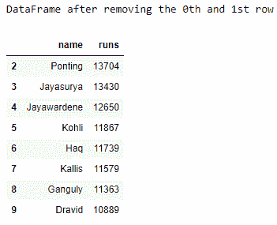
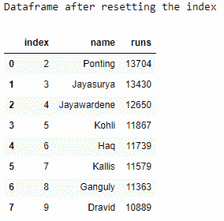

# 熊猫–如何在给定的数据帧中重置索引

> 原文:[https://www . geesforgeks . org/pandas-如何重置给定数据框中的索引/](https://www.geeksforgeeks.org/pandas-how-to-reset-index-in-a-given-dataframe/)

让我们看看如何在从数据帧中删除一些行后重置数据帧的索引。
**进场:**

1.  导入熊猫模块。
2.  创建一个数据帧。
3.  使用 Drop()方法从数据框中删除一些行。
4.  使用 reset_index()方法重置数据帧的索引。
5.  在每个步骤后显示数据框。

## 蟒蛇 3

```py
# importing the modules
import pandas as pd
import numpy as np

# creating a DataFrame
ODI_runs = {'name': ['Tendulkar', 'Sangakkara', 'Ponting',
                      'Jayasurya', 'Jayawardene', 'Kohli',
                      'Haq', 'Kallis', 'Ganguly', 'Dravid'],
            'runs': [18426, 14234, 13704, 13430, 12650,
                     11867, 11739, 11579, 11363, 10889]}
df = pd.DataFrame(ODI_runs)

# displaying the original DataFrame
print("Original DataFrame :")
print(df)

# dropping the 0th and the 1st index
df = df.drop([0, 1])

# displaying the altered DataFrame
print("DataFrame after removing the 0th and 1st row")
print(df)

# resetting the DataFrame index
df = df.reset_index()

# displaying the DataFrame with new index
print("Dataframe after resetting the index")
print(df)
```

**输出:**




