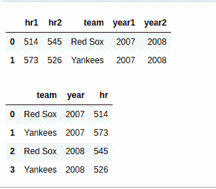

# Python 中 pandas.lreshape()函数

> 原文:[https://www . geesforgeks . org/pandas-lre shape-function-in-python/](https://www.geeksforgeeks.org/pandas-lreshape-function-in-python/)

此方法用于将长格式数据重新整形为宽格式。这是 [DataFrame.pivot](https://www.geeksforgeeks.org/python-pandas-pivot/) 的广义逆。

> **语法:** pandas.lreshape(数据，组，dropna=True，label=None)
> 
> **论据:**
> 
> *   **数据:**数据帧
> *   **组:**dict { new _ name:list _ of _ columns }
> *   **dropna** :布尔值，默认为真

下面是上述方法的一个示例实现:

## 蟒蛇 3

```py
# importing package
import numpy
import pandas as pd

# create and view data
data = pd.DataFrame({
    'hr1': [514, 573],
    'hr2': [545, 526],
    'team': ['Red Sox', 'Yankees'],
    'year1': [2007, 2007],
    'year2': [2008, 2008]
})
print(data)

# use pandas.lreshape() method
print(pd.lreshape(data, {'year': ['year1', 'year2'],
                         'hr': ['hr1', 'hr2']}))
# This code is contributed by rakeshsahni
```

**输出:**

