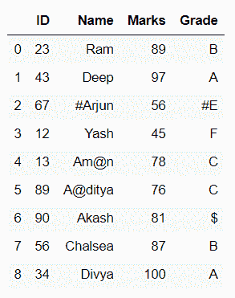
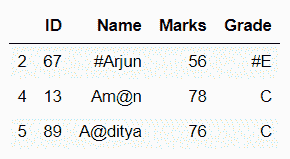

# 熊猫删除带有特殊字符的行

> 原文:[https://www . geeksforgeeks . org/pandas-移除带有特殊字符的行/](https://www.geeksforgeeks.org/pandas-remove-rows-with-special-characters/)

在本文中，我们将学习如何删除带有特殊字符的行，即；如果一行包含任何包含特殊字符的值，如@、%、&、$、#、+、-、*、/，等等。然后删除这样的行并修改数据。要删除这种类型的行，首先，我们必须搜索每列有特殊字符的行，然后删除。为了搜索，我们使用[正则表达式](https://www.geeksforgeeks.org/regular-expression-python-examples-set-1/)[ @ #&$ %+-/*]或【^0-9a-zA-Z].让我们用一些例子来讨论整个过程:

**例 1:**

这个例子由一些带有代码的部分组成，使用的数据框可以通过点击 [**data1.csv**](https://drive.google.com/file/d/1s1oO14CvU1D4XZjW2927KhMsZoRHMU2k/view?usp=sharing) 下载或者如下图所示。

## 蟒蛇 3

```py
# importing package
import pandas as pd

# load dataset
df = pd.read_csv("data1.csv")

# view dataset
print(df)
```

**输出:**



**选择列具有特殊字符值的行**

## 蟒蛇 3

```py
# select the rows
# if Name column
# has special characters
print(df[df.Name.str.contains(r'[@#&$%+-/*]')])
```

**输出:**



## 蟒蛇 3

```py
# select the rows
# if Grade column
# has special characters
print(df[df.Grade.str.contains(r'[^0-9a-zA-Z]')])
```