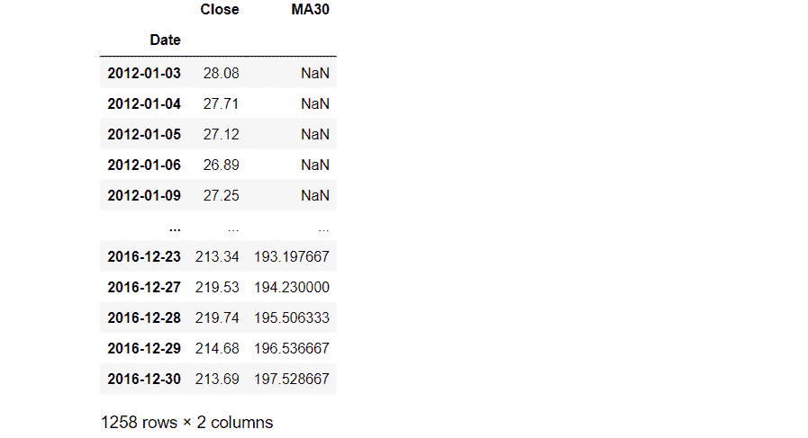
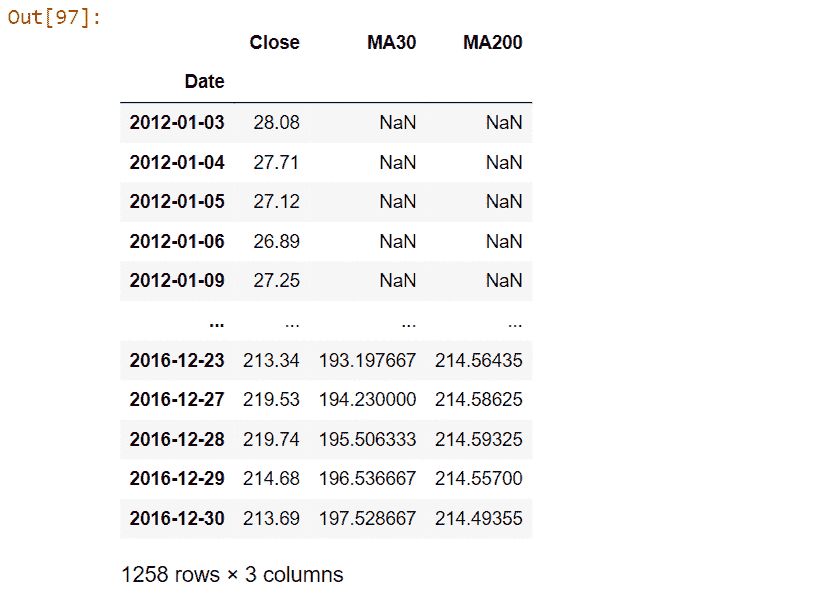
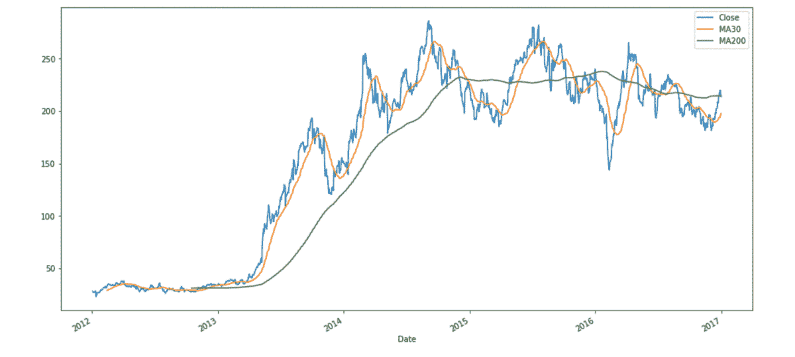

# 熊猫-时间间隔滚动平均值

> 原文:[https://www . geesforgeks . org/pandas-按时间间隔滚动平均值/](https://www.geeksforgeeks.org/pandas-rolling-mean-by-time-interval/)

在本文中，我们将研究如何使用 Python 中的 Pandas 按时间间隔计算数据帧的滚动平均值。

熊猫[**data frame . rolling()**](https://www.geeksforgeeks.org/python-pandas-dataframe-rolling/)**是一个帮助我们在滚动窗口上进行计算的函数。换句话说，我们取一个固定大小的窗口，对其进行一些数学计算。**

> ****语法:**数据帧滚动(窗口，最小周期=无，中心=假，win _ type =无，开=无，轴=0)。平均值()**
> 
>  ****参数**:
> 
> *   **窗口**:窗口大小。这就是我们在计算每一个窗口时需要观察的次数。
> *   **min_periods** :窗口中需要有值的最少观察次数(否则结果为 n a)。
> *   **居中**:用于将标签设置在窗口的中央。
> *   **win_type** :用于设置窗口类型。
> *   上的**:我们必须计算滚动平均值的数据帧的 Datetime 列。**
> *   **轴**:整数或字符串，默认为 0**

****使用的数据集:** [特斯拉 _ 股票](https://media.geeksforgeeks.org/wp-content/cdn-uploads/20211021183651/Tesla_Stock.csv)**

## **逐步实施**

### ****步骤 1:导入库****

## **蟒蛇 3**

```py
# import pandas as pd
import pandas as pd
```

### **步骤 2:导入数据**

## **蟒蛇 3**

```py
# importing Data
tesla_df = pd.read_csv('Tesla_Stock.csv', index_col='Date', 
                       parse_dates=True)

# printing the dataFrame
tesla_df.head(10)
```

****输出**:**

****

**我们将计算数据框“关闭”列的滚动平均值。**

### ****第三步:计算滚动平均值****

## **蟒蛇 3**

```py
# Updating the dataFrame with just the 
# column 'Close' as others columns are 
# of no use right now we have used .to_frame
# which converts Series to a DataFrame.
tesla_df = tesla_df['Close'].to_frame()

# calculating Rolling mean and storing it 
# into a new column of existing dataFrame
# we have set the window as 30 and rest all
# parameters are set to default.
tesla_df['MA30'] = tesla_df['Close'].rolling(30).mean()

# Rolling mean is also called as Moving Average ,
# hence we have used the notation MA
# and MA30 is the moving average (rolling mean) 
# of 30 days

# printing dataframe
tesla_df
```

****输出:****

****

**列 MA30 的前 29 行将具有空值，第一个非空值将在第 30 行。现在我们将计算窗口为 200 的滚动平均值。**

## **蟒蛇 3**

```py
# calculating Rolling mean and storing it into
# a new column of existing dataFrame we have set
# the window as 200 and rest all parameters are 
# set to default.
tesla_df['MA200'] = tesla_df['Close'].rolling(200).mean()

# Rolling mean is also called as Moving Average, hence
# we have used the notation MA and MA200 is the moving
# average (rolling mean) of 200 days

# printing dataframe
tesla_df
```

****输出**:**

****

**对于“MA200”，第一个非空值将出现在第 200 行。现在让我们绘制“MA30”、“MA200”和“Close”以获得更好的可视化效果**

### **第四步:绘图**

## **蟒蛇 3**

```py
# importing matplotlib module
import matplotlib.pyplot as plt
plt.style.use('default')

# %matplotlib inline: only draw static
# images in the notebook
%matplotlib inline

tesla_df[['Close', 'MA30', 'MA200']].plot(
  label='tesla', figsize=(16, 8))
```

****输出:****

****