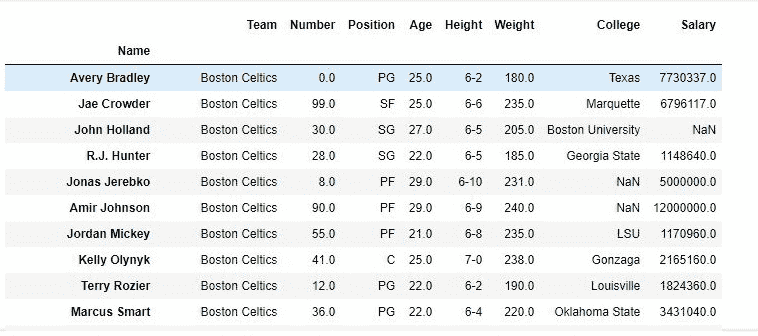

# Python |使用 Pandas.drop()

从数据框中删除行/列

> 原文:[https://www . geesforgeks . org/python-delete-row-columns-from-data frame-use-pandas-drop/](https://www.geeksforgeeks.org/python-delete-rows-columns-from-dataframe-using-pandas-drop/)

Python 是进行数据分析的优秀语言，主要是因为以数据为中心的 Python 包的奇妙生态系统。 ***【熊猫】*** 就是其中一个包，让导入和分析数据变得容易多了。

熊猫为数据分析师提供了一种使用 **`.drop()`** 方法删除和过滤数据帧的方法。使用此方法，可以使用索引标签或列名删除行或列。

> **语法:**
> 数据框。删除(标签=无，轴=0，索引=无，列=无，级别=无，位置=假，错误= '提升')
> 
> **参数:**
> 
> **标签:**表示行或列名称的字符串或字符串列表。
> **轴:** int 或 string 值，0 'index '代表行，1 'columns '代表列。
> **索引或列:**单个标签或列表。索引或列是 axis 的替代项，不能一起使用。
> **级别:**用于指定数据帧有多级索引时的级别。
> **在位:**如果为真，则对原始数据框进行更改。
> **错误:**如果列表中没有任何值，则忽略错误，并在错误=“忽略”时丢弃其余值
> 
> **返回类型:**具有丢弃值的数据帧

要下载代码中使用的 CSV，点击这里的[。](https://media.geeksforgeeks.org/wp-content/uploads/nba.csv)

**示例#1:按索引标签删除行**
在他的代码中，传递了一个索引标签列表，并使用。drop()方法。

```py
# importing pandas module
import pandas as pd

# making data frame from csv file
data = pd.read_csv("nba.csv", index_col ="Name" )

# dropping passed values
data.drop(["Avery Bradley", "John Holland", "R.J. Hunter",
                            "R.J. Hunter"], inplace = True)

# display
data
```

**输出:**
如输出图像所示，新输出没有传递的值。这些值被删除，并且在原始数据帧中进行了更改，因为 inplace 为 True。

**删除值前的数据框-**


**删除值后的数据框-**


**示例 2:删除列名为**的列

在他的代码中，传递的列使用列名删除。`axis` 参数保持 1，因为 1 是指列。

```py
# importing pandas module
import pandas as pd

# making data frame from csv file
data = pd.read_csv("nba.csv", index_col ="Name" )

# dropping passed columns
data.drop(["Team", "Weight"], axis = 1, inplace = True)

# display
data
```

**输出:**
如输出图像所示，新输出没有传递的列。由于 axis 设置为等于 1，这些值被删除，并且由于 inplace 为 True，原始数据框中进行了更改。

**删除列前的数据框-**


**删除列后的数据框-**
