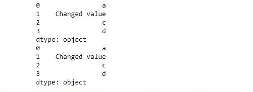
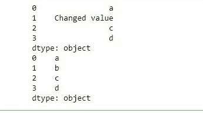

# Python | pandas . copy()和通过变量复制的区别

> 原文:[https://www . geesforgeks . org/python-熊猫之间的差异-通过变量复制和复制/](https://www.geeksforgeeks.org/python-difference-between-pandas-copy-and-copying-through-variables/)

***熊猫。copy()*** 方法用于创建熊猫对象的副本。变量也用于生成对象的副本，但变量只是指向对象的指针，新数据的任何变化也会改变以前的数据。

以下示例将显示通过变量复制和 Pandas.copy()方法之间的区别。

**示例#1:** 通过变量进行复制
在此示例中，制作了一个 Pandas 系列样本，并将其复制到一个新变量中。之后，对新数据进行一些更改，并与旧数据进行比较。

```
# importing pandas module
import pandas as pd

# creating sample series
data = pd.Series(['a', 'b', 'c', 'd'])

# creating copy of series
new = data

# assigning new values
new[1]='Changed value'

# printing data
print(new)
print(data)
```

**输出:**
如输出图像所示，由于新变量只是一个指向旧变量的指针，因此新数据中所做的更改也会反映在旧数据中。


**示例 2:** 使用 Pandas.copy()方法
在本例中，pandas.copy()方法用于复制数据，并对新数据进行了一些更改。然后将这些变化与旧数据进行比较。

```
# importing pandas module
import pandas as pd

# creating sample series
data = pd.Series(['a', 'b', 'c', 'd'])

# creating copy of series
new = data.copy()

# assigning new values
new[1]='Changed value'

# printing data
print(new)
print(data)
```

**输出:**
如输出图所示，新数据的变化是独立的，旧数据没有变化。
