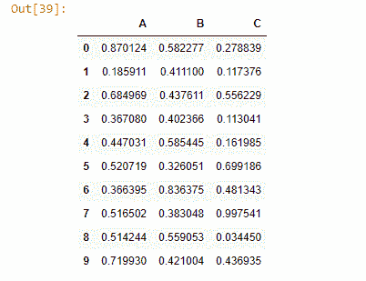
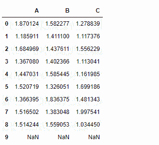
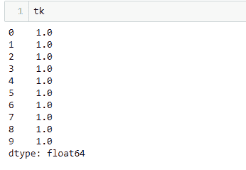
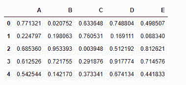
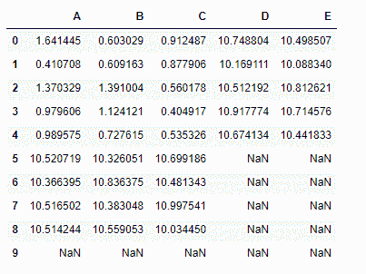

# Python | Pandas data frame . add()

> 原文:[https://www.geeksforgeeks.org/python-pandas-dataframe-add/](https://www.geeksforgeeks.org/python-pandas-dataframe-add/)

Python 是进行数据分析的优秀语言，主要是因为以数据为中心的 Python 包的奇妙生态系统。Pandas 就是其中之一，它让数据的导入和分析变得更加容易。

`Dataframe.add()`方法用于添加数据帧和其他元素(二元运算符 add)。相当于 dataframe + other，但支持用 fill_value 替换其中一个输入中缺失的数据。

> **语法:** DataFrame.add(其他，轴= '列'，级别=无，fill _ value =无)
> 
> **参数:**
> 
> **其他:**系列、数据框或常量
> **轴:** {0，1，'索引'，'列' }对于系列输入，轴要与
> **上的系列索引匹配 fill_value :** 【无或浮点值，默认无】用该值填充缺失(NaN)值。如果两个数据框位置都丢失，结果也将丢失。
> **级别:**【int 或 name】跨级别广播，在传递的多索引级别上匹配索引值
> 
> **返回:**结果数据框

```py
# Importing Pandas as pd
import pandas as pd

# Importing numpy as np
import numpy as np

# Creating a dataframe
# Setting the seed value to re-generate the result.
np.random.seed(25)

df = pd.DataFrame(np.random.rand(10, 3), columns =['A', 'B', 'C'])

# np.random.rand(10, 3) has generated a
# random 2-Dimensional array of shape 10 * 3
# which is then converted to a dataframe

df
```



**注意:** `add()` 功能类似于“+”操作，但是，`add()`为其中一个输入中的缺失值提供了额外的支持。

```py
# We want NaN values in dataframe. 
# so let's fill the last row with NaN value
df.iloc[-1] = np.nan

df
```


**使用`add()`功能向数据框添加一个常量值:**

```py
# add 1 to all the elements
# of the data frame
df.add(1)

```



请注意上面的输出，在 *df* `dataframe.add()` 函数中的 nan 单元格没有添加属性`fill_value`。这将使用指定的值来填充缺少的值(Nan)。如果两个 dataframe 值都丢失，则结果也将丢失。

让我们看看怎么做。

```py
# We have given a default value
# of '10' for all the nan cells
df.add(1, fill_value = 10)
```


所有的 *nan* 单元格都已经先填充了 10 个，然后再添加 1 个。

**向数据框添加系列:**

对于序列输入，数据框和序列的索引维度必须匹配。

```py
# Create a Series of 10 values
tk = pd.Series(np.ones(10))

# tk is a Series of 10 elements
# all filled with 1
```



```py
# Add tk(series) to the df(dataframe)
# along the index axis
df.add(tk, axis ='index')
```


**将一个数据帧与其他数据帧相加**

```py
# Create a second dataframe
# First set the seed to regenerate the result
np.random.seed(10)

# Create a 5 * 5 dataframe
df2 = pd.DataFrame(np.random.rand(5, 5), columns =['A', 'B', 'C', 'D', 'E'])

df2
```



让我们执行这两个数据帧的元素相加

```py
df.add(df2)
```


请注意，生成的数据框的尺寸为 10*5，并且在所有这些单元格中，该数据框都具有 *nan* 值。

让我们解决它–

```py
# Set a default value of 10 for nan cells
# nan value won't be filled for those cells
# in which both data frames has nan value
df.add(df2, fill_value = 10)
```

