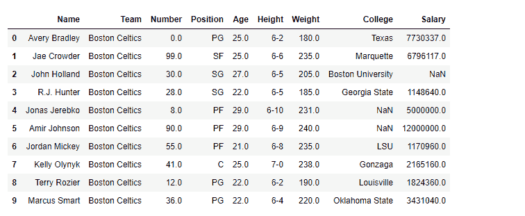

# Python | Pandas data frame . aggregate()

> 原文:[https://www . geesforgeks . org/python-pandas-data frame-aggregate/](https://www.geeksforgeeks.org/python-pandas-dataframe-aggregate/)

Python 是进行数据分析的优秀语言，主要是因为以数据为中心的 Python 包的奇妙生态系统。 ***【熊猫】*** 就是其中一个包，让导入和分析数据变得容易多了。

Dataframe.aggregate()函数用于跨一列或多列应用某种聚合。使用可调用、字符串、字典或字符串/可调用列表进行聚合。最常用的聚合是:

**总和:**返回请求轴的值总和
**最小值:**返回请求轴的值最小值
**最大值:**返回请求轴的值最大值

> **语法:** DataFrame.aggregate(func，axis=0，*args，**kwargs)
> 
> **参数:**
> **功能:**可调用、字符串、字典或字符串/可调用列表。用于聚合数据的函数。如果是函数，则必须在传递数据帧或传递给数据帧时工作。应用。对于数据帧，如果键是数据帧列名，则可以传递字典。
> **轴:(默认 0)** {0 或' index '，1 或' columns'} 0 或' index ':对每列应用函数。1 或“列”:对每行应用函数。
> 
> **返回:**聚合数据帧

有关代码中使用的 CSV 文件的链接，请单击此处的

**示例#1:** 在数据框中的所有列上聚合“sum”和“min”函数。

```
# importing pandas package
import pandas as pd

# making data frame from csv file
df = pd.read_csv("nba.csv")

# printing the first 10 rows of the dataframe
df[:10]
```



聚合仅适用于数值类型的列。

```
# Applying aggregation across all the columns 
# sum and min will be found for each 
# numeric type column in df dataframe

df.aggregate(['sum', 'min'])
```

**输出:**
对于具有数值的每一列，已经找到所有值的最小值和总和。对于数据框 *df* ，我们有四个这样的列数字，年龄，体重，工资。


**例 2:**

在 Pandas 中，我们还可以跨不同的列应用不同的聚合函数。为此，我们需要传递一个包含列名和值的字典，这些列名和值包含任何特定列的聚合函数列表。

```
# importing pandas package
import pandas as pd

# making data frame from csv file
df = pd.read_csv("nba.csv")

# We are going to find aggregation for these columns
df.aggregate({"Number":['sum', 'min'],
              "Age":['max', 'min'],
              "Weight":['min', 'sum'], 
              "Salary":['sum']})
```

**输出:**
已经对每一列应用了单独的聚合，如果没有对某一列应用任何特定的聚合，则它具有与之对应的 NaN 值。
