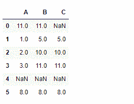

# Python | Pandas data frame . bfill()

> 原文:[https://www . geesforgeks . org/python-pandas-data frame-bfill/](https://www.geeksforgeeks.org/python-pandas-dataframe-bfill/)

Python 是进行数据分析的优秀语言，主要是因为以数据为中心的 python 包的奇妙生态系统。 ***【熊猫】*** 就是其中一个包，让导入和分析数据变得容易多了。

Pandas `**dataframe.bfill()**`用于向后填充数据集中缺失的值。它将向后填充熊猫数据框中的`NaN`值。

> **语法:** DataFrame.bfill(轴=无，在位=假，限制=无，向下转换=无)
> 
> **参数:**
> **轴:**【行】或【列】
> **在位:**布尔值，默认为假
> **限制:**整数值，要填充的连续`na`单元格的数量。

**示例#1:** 使用`bfill()`函数跨行填充数据框中缺失的值`na`值。

```
# importing pandas as pd
import pandas as pd

# Creating a dataframe with "na" values.

df = pd.DataFrame({"A":[None, 1, 2, 3, None, None], 
                   "B":[11, 5, None, None, None, 8],
                   "C":[None, 5, 10, 11, None, 8]})

# Printing the dataframe
df
```


当`axis='rows'`时，则当前`na`单元格中的值从下一行的相应值开始填充。如果下一行也是`na`值，那么它不会被填充。

```
# Fill across the row
df.bfill(axis ='rows')
```

**输出:**


**示例 2:** 使用`bfill()`函数跨列填充数据框中缺失的值`na`值。

当`axis='columns'`时，当前`na`单元格将从同一行下一列的值开始填充。如果下一列也是`na`单元格，则不会被填充。

```
# importing pandas as pd
import pandas as pd

# Creating a dataframe with "na" values.

df = pd.DataFrame({"A":[None, 1, 2, 3, None, None],
                   "B":[11, 5, None, None, None, 8],
                   "C":[None, 5, 10, 11, None, 8]})

# bfill values using values from next column
df.bfill(axis ='columns')
```

**输出:**


注意第四行。所有的值都是`na`，因为最右边的单元格最初是`na`，并且它的右边没有可以填充自己的单元格。因此，它也不能填充先前的`na`细胞。