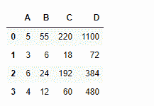

# python | pandas data frame . cumber()

> 哎哎哎:# t0]https://www . geeksforgeeks . org/python 熊猫 data frame-cumber/

Python 是进行数据分析的优秀语言，主要是因为以数据为中心的 python 包的奇妙生态系统。 ***【熊猫】*** 就是其中一个包，让导入和分析数据变得容易多了。

熊猫 `**dataframe.cumprod()**`用于查找任意轴上迄今为止所见数值的**累计乘积。**
每个单元格都填充了迄今为止看到的值的累积乘积。

> **语法:**data frame . cum prod(axis =无，skipna =真，*args，* * * kwargs)
> 
> **参数:**
> **轴:**{索引(0)，列(1)}
> **skipna :** 排除 NA/null 值。如果整行/整列为“无”，结果将为“无”
> 
> **退货:**产品:系列

**示例#1:** 使用`cumprod()`函数查找沿指数轴到目前为止看到的值的累积乘积。

```py
# importing pandas as pd
import pandas as pd

# Creating the dataframe
df = pd.DataFrame({"A":[5, 3, 6, 4],
                   "B":[11, 2, 4, 3],
                   "C":[4, 3, 8, 5], 
                   "D":[5, 4, 2, 8]})

# Print the dataframe
df
```

**输出:**


现在找到在索引轴上看到的值的累积乘积

```py
# To find the cumulative prod
df.cumprod(axis = 0)
```

**输出:**


**示例 2:** 使用`cumprod()`函数查找沿列轴到目前为止看到的值的累积乘积。

```py
# importing pandas as pd
import pandas as pd

# Creating the dataframe
df = pd.DataFrame({"A":[5, 3, 6, 4], 
                   "B":[11, 2, 4, 3],
                   "C":[4, 3, 8, 5], 
                   "D":[5, 4, 2, 8]})

# cumulative product along column axis
df.cumprod(axis = 1)
```

**输出:**



**示例#3:** 使用`cumprod()`函数查找数据帧中沿索引轴看到的值与数据帧中出现的`NaN`值的累积乘积。

```py
# importing pandas as pd
import pandas as pd

# Creating the dataframe
df = pd.DataFrame({"A":[5, 3, None, 4],
                   "B":[None, 2, 4, 3], 
                   "C":[4, 3, 8, 5], 
                   "D":[5, 4, 2, None]})

# To find the cumulative product
df.cumprod(axis = 0, skipna = True)
```

**输出:**


输出是一个带有单元格的数据框，这些单元格包含迄今为止沿索引轴看到的值的累积乘积。跳过数据帧中的任何`Nan`值。