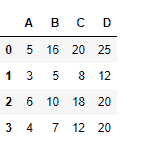
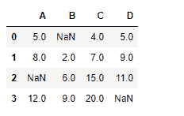

# python | pandas data frame . cum sum()

> 哎哎哎:# t0]https://www . geeksforgeeks . org/python 熊猫 data frame-cusum/

Python 是进行数据分析的优秀语言，主要是因为以数据为中心的 python 包的奇妙生态系统。 ***【熊猫】*** 就是其中一个包，让导入和分析数据变得容易多了。

熊猫 `**dataframe.cumsum()**`用于**求任意轴上的累计和值。**每个单元格都填充了迄今为止看到的值的累积总和。

> **语法:** DataFrame.cumsum(轴=无，skipna =真，*参数，* * * kwargs)
> 
> **参数:**
> **轴:**{索引(0)，列(1)}
> **skipna :** 排除 NA/null 值。如果整行/整列为“无”，结果将为“无”
> 
> **返回:**总和:系列

**示例#1:** 使用`cumsum()`函数，沿指数轴查找数值的累计和。

```
# importing pandas as pd
import pandas as pd

# Creating the dataframe
df = pd.DataFrame({"A":[5, 3, 6, 4],
                   "B":[11, 2, 4, 3],
                   "C":[4, 3, 8, 5],
                   "D":[5, 4, 2, 8]})

# Print the dataframe
df
```

**输出:**


现在找到索引轴上的值的累积和

```
# To find the cumulative sum
df.cumsum(axis = 0)
```

**输出:**


**示例#2:** 使用`cumsum()`函数来查找到目前为止沿着列轴看到的值的累积和。

```
# importing pandas as pd
import pandas as pd

# Creating the dataframe
df = pd.DataFrame({"A":[5, 3, 6, 4],
                   "B":[11, 2, 4, 3],
                   "C":[4, 3, 8, 5],
                   "D":[5, 4, 2, 8]})

# To find the cumulative sum along column axis
df.cumsum(axis = 1)
```

**输出:**


**示例#3:** 使用`cumsum()`函数查找数据帧中沿索引轴到目前为止看到的值的累积和，其中`NaN`值出现在数据帧中。

```
# importing pandas as pd
import pandas as pd

# Creating the dataframe
df = pd.DataFrame({"A":[5, 3, None, 4],
                   "B":[None, 2, 4, 3],
                   "C":[4, 3, 8, 5],
                   "D":[5, 4, 2, None]})

# To find the cumulative sum
df.cumsum(axis = 0, skipna = True)
```

**输出:**


输出是一个数据帧，其单元格包含迄今为止沿索引轴看到的值的累积总和。跳过数据帧中的任何`Nan`值。