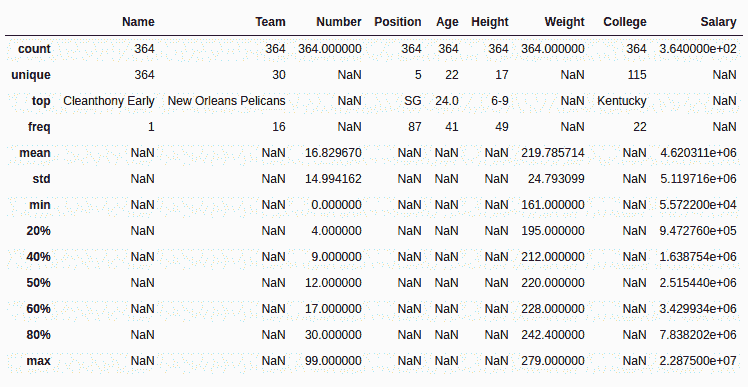

# Python | Pandas data frame . description()方法

> 原文:[https://www . geesforgeks . org/python-pandas-data frame-description-method/](https://www.geeksforgeeks.org/python-pandas-dataframe-describe-method/)

Python 是进行数据分析的优秀语言，主要是因为以数据为中心的 Python 包的奇妙生态系统。 ***【熊猫】*** 就是其中一个包，让导入和分析数据变得容易多了。

熊猫 **`describe()`** 用来查看一些基本的统计细节，比如百分位、均值、std 等。数据框或一系列数值。当此方法应用于一系列字符串时，它会返回不同的输出，如下例所示。

> **语法:**数据框描述(百分位数=无，包含=无，排除=无)
> 
> **参数:**
> **百分位:**在 0-1 之间列出类似数据类型的数字以返回各自的百分位
> **包括:**描述数据帧时要包括的数据类型列表。默认为无
> **排除:**描述数据帧时要排除的数据类型列表。默认值为无
> 
> **返回类型:**数据帧统计汇总。

要下载下例使用的数据集，点击这里的[。](https://media.geeksforgeeks.org/wp-content/uploads/nba.csv)
在下面的例子中，使用的数据框包含了一些 NBA 球员的数据。任何操作前的数据框图像附在下面。


**示例#1:** 用对象和数字数据类型描述数据框

在本例中，描述了数据框，并传递['object']以包含参数来查看对象系列的描述。[.20，. 40，. 60，. 80]被传递到百分点参数，以查看数值系列的各个百分点。

```
# importing pandas module 
import pandas as pd 

# importing regex module
import re

# making data frame 
data = pd.read_csv("https://media.geeksforgeeks.org/wp-content/uploads/nba.csv") 

# removing null values to avoid errors 
data.dropna(inplace = True) 

# percentile list
perc =[.20, .40, .60, .80]

# list of dtypes to include
include =['object', 'float', 'int']

# calling describe method
desc = data.describe(percentiles = perc, include = include)

# display
desc
```

**输出:**
如输出图像所示，返回了数据帧的统计描述以及相应的传递百分比。对于带有字符串的列，数值操作返回 NaN。


**例 2:** 描述一系列字符串

在本例中，名称列调用 description 方法来查看对象数据类型的行为。

```
# importing pandas module 
import pandas as pd 

# importing regex module
import re

# making data frame 
data = pd.read_csv("https://media.geeksforgeeks.org/wp-content/uploads/nba.csv") 

# removing null values to avoid errors 
data.dropna(inplace = True) 

# calling describe method
desc = data["Name"].describe()

# display
desc
```

**输出:**
如输出图像所示，description()的行为因一系列字符串而异。
在这种情况下，返回了不同的统计数据，如数值计数、唯一值、顶部和出现频率。
