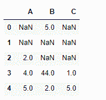
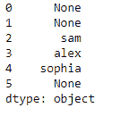

# Python | Pandas data frame . first _ valid _ index()

> 原文:[https://www . geesforgeks . org/python-pandas-data frame-first _ valid _ index/](https://www.geeksforgeeks.org/python-pandas-dataframe-first_valid_index/)

Python 是进行数据分析的优秀语言，主要是因为以数据为中心的 python 包的奇妙生态系统。 ***【熊猫】*** 就是其中一个包，让导入和分析数据变得容易多了。

熊猫 `**dataframe.first_valid_index()**`函数返回数据帧中第一个非数值/空值的索引。在熊猫系列的情况下，返回第一个非 NA/null 索引。在熊猫数据帧的情况下，返回的索引甚至只有一个非空值。

**注意:**如果所有元素都是非 NA/null，则返回 None。对于空数据帧，也返回无

> **语法:**data frame . first _ valid _ index()
> **返回:**标量:索引类型

**示例#1:** 使用`first_valid_index()`函数查找数据帧中的第一个非 NA/null 索引。

```py
# importing pandas as pd
import pandas as pd

# Creating the dataframe 
df = pd.DataFrame({"A":[None, None, 2, 4, 5], 
                   "B":[5, None, None, 44, 2],
                   "C":[None, None, None, 1, 5]})

# Print the dataframe
df
```



现在应用`first_valid_index()`功能。

```py
# applying first_valid_index() function 
df.first_valid_index()
```

**输出:**


注意，第一行第二列有`non-Na`值。所以输出为 0，表示第 0 个索引包含一个`non-NA`值。

**示例 2:** 使用`first_valid_index()`函数查找数据框中的第一个非 NA/null 索引。

```py
# importing pandas as pd
import pandas as pd

# Creating the dataframe 
df = pd.DataFrame({"A":[None, None, 2, 4, 5],
                   "B":[None, None, None, 44, 2],
                   "C":[None, None, None, 1, 5]})

# applying first_valid_index() function 
df.first_valid_index()
```

**输出:**


正如我们在数据框中看到的，前两行只有`NA`值。所以，输出是 2

**示例#3:** 使用`first_valid_index()`函数查找序列中的第一个非 NA/null 索引。

```py
# importing pandas as pd
import pandas as pd

# Creating the series
ser = pd.Series([None, None, "sam", "alex", "sophia", None])

# Print the series
ser
```



现在应用`first_valid_index()`功能。

```py
# applying first_valid_index() function 
ser.first_valid_index()
```

**输出:**

输出为 2，因为第 0 和第 1 个索引的值为空。