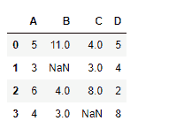
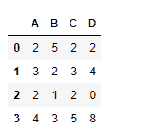

# python | pandas data frame . flood rdiv()

> 哎哎哎:# t0]https://www . geeksforgeeks . org/python 熊猫 data frame-flood rdiv/

Python 是进行数据分析的优秀语言，主要是因为以数据为中心的 python 包的奇妙生态系统。 ***【熊猫】*** 就是其中一个包，让导入和分析数据变得容易多了。
Pandas**data frame . floor div()**函数用于对数据帧进行整数分割，可以是常量、序列或任何其他*数据帧。
如果其他是系列，则系列的尺寸必须与数据框的分割轴相匹配。如果另一个是数据帧，那么两个数据帧应该具有相同的维度。
相当于 dataframe/other，但支持用 fill_value 替换其中一个输入中缺失的数据。* 

> ***语法:** DataFrame.floordiv(其他，轴='columns '，level=None，fill_value=None)
> **参数:**
> **其他:** Series，DataFrame，或常量
> **轴:**对于 Series 输入，轴要与
> **上的 Series 索引匹配 fill_value :** 用该值填充缺失(NaN)值。如果两个数据帧位置都丢失，结果将丢失
> **级别:**跨级别广播，匹配传递的多索引级别上的索引值
> **返回:**结果:数据帧*

***示例#1:** 使用 floordiv()函数查找具有**常数**的数据帧的整数除法。数据框包含数值。* 

## *蟒蛇 3*

```py
*# importing pandas as pd
import pandas as pd

# Creating the dataframe
df = pd.DataFrame({"A":[5, 3, 6, 4],
                   "B":[11, None, 4, 3],
                   "C":[4, 3, 8, None],
                   "D":[5, 4, 2, 8]})

# Print the dataframe
df*
```

**

*现在应用 floordiv()函数。在我们的数据框中，我们有数值。我们用 50 来填充所有这些值。* 

## *蟒蛇 3*

```py
*# applying floordiv() function
df.floordiv(2, fill_value = 50)*
```

***输出:*** 

**

*请注意，在执行整数除法之前，数据框中的所有非 Na 值都已用 50 填充。

**示例 2:** 使用 floordiv()函数找到带有**系列**的数据帧的整数除法。* 

## *蟒蛇 3*

```py
*# importing pandas as pd
import pandas as pd

# Creating the dataframe
df = pd.DataFrame({"A":[5, 3, 6, 4],
                   "B":[11, 2, 4, 3],
                   "C":[4, 3, 8, 5],
                   "D":[5, 4, 2, 8]})

# creating series
sr = pd.Series([2, 1, 3, 1])

# applying floordiv() function
df.floordiv(sr, axis = 0)*
```

***输出:*** 

**

*dataframe 的每一行都除以 series 对象中的相应值。*