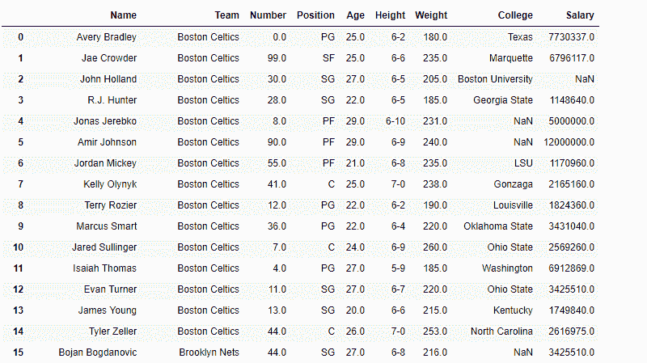
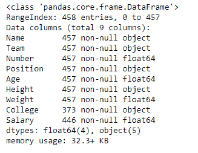

# python | pandas data frame . info()

> 哎哎哎:# t0]https://www . geeksforgeeks . org/python 熊猫 dataframe-info/

Python 是进行数据分析的优秀语言，主要是因为以数据为中心的 python 包的奇妙生态系统。 ***【熊猫】*** 就是其中一个包，让导入和分析数据变得容易多了。
熊猫 **dataframe.info()** 功能用于获取数据帧的简明摘要。当对数据进行探索性分析时，它非常方便。为了快速了解数据集，我们使用 dataframe.info()函数。

> **语法:** DataFrame.info(verbose=None，buf=None，max_cols=None，memory_usage=None，null_counts=None)
> **参数:**
> **verbose :** 是否打印完整摘要。无符合 display.max_info_columns 设置。“真”或“假”覆盖“显示. max_info_columns”设置。
> **buf :** 可写缓冲区，默认为 sys . stdout
> **max _ cols:**决定是打印全汇总还是短汇总。无符合 display.max_info_columns 设置。
> **memory_usage :** 指定是否应显示数据框元素(包括索引)的总内存使用量。没有一个遵循 display.memory_usage 设置。“真”或“假”会覆盖“显示内存使用情况”设置。“深”的值相当于“真”，具有深度内省。内存使用情况以人类可读的单位(基数-2 表示)显示。
> **空计数:**是否显示非空计数。如果为“无”，则仅当框架小于最大信息行数和最大信息列数时才显示。如果为真，则始终显示计数。如果为假，则从不显示计数。

有关代码中使用的 CSV 文件的链接，请单击此处的
**示例#1:** 使用 info()函数打印数据帧的完整摘要。

## 蟒蛇 3

```
# importing pandas as pd
import pandas as pd

# Creating the dataframe
df = pd.read_csv("nba.csv")

# Print the dataframe
df
```



让我们打印数据帧的完整摘要。

## 蟒蛇 3

```
# to print the full summary
df.info()
```

**输出:**



正如我们在输出中看到的，摘要包括所有列的列表及其数据类型，以及每列中非空值的数量。我们还为索引轴提供了 rangeindex 的值。

**示例#2:** 使用 info()函数打印数据帧的简短摘要
**注意:**为了打印简短摘要，我们可以使用 verbose 参数并将其设置为 False。

## 蟒蛇 3

```
# importing pandas as pd
import pandas as pd

# Creating the dataframe
df = pd.read_csv("nba.csv")

# Print the short summary of the
# dataframe by setting verbose = False
df.info(verbose = False)
```