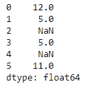
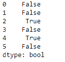

# Python | Pandas data frame . ISNA()

> 原文:[https://www.geeksforgeeks.org/python-pandas-dataframe-isna/](https://www.geeksforgeeks.org/python-pandas-dataframe-isna/)

Python 是进行数据分析的优秀语言，主要是因为以数据为中心的 python 包的奇妙生态系统。 ***【熊猫】*** 就是其中一个包，让导入和分析数据变得容易多了。

熊猫 `**dataframe.isna()**`功能用于检测缺失值。它返回一个相同大小的布尔对象，指示值是否为“无”。数值，如无或数值。NaN，映射到真值。其他的都被映射到假值。空字符串”或 numpy.inf 等字符不被视为 NA 值(除非您将 pandas . options . mode . use _ INF _ as _ NA 设置为 True)。

> **语法:** DataFrame.isna()
> 
> **返回:**数据帧中每个元素的布尔值掩码，指示某个元素是否不是安娜值。

要链接到示例中使用的 CSV 文件，请单击此处的

**示例#1:** 使用`isna()`功能检测数据帧中的缺失值。

```py
# importing pandas as pd
import pandas as pd

# Creating the dataframe 
df = pd.read_csv("nba.csv")

# Print the dataframe
df
```


让我们使用`isna()`功能来检测丢失的值。

```py
# detect the missing values
df.isna()
```

**输出:**

在输出中，缺失值对应的单元格包含真值否则为假。

**示例 2:** 使用`isna()`功能检测熊猫系列对象中的缺失值

```py
# importing pandas as pd
import pandas as pd

# Creating the series 
sr = pd.Series([12, 5, None, 5, None, 11])

# Print the series
sr
```



让我们检测系列中所有缺失的值。

```py
# to detect the missing values
sr.isna()
```

**输出:**
