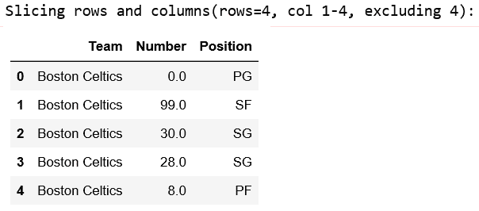
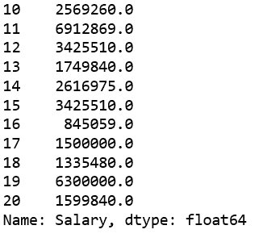
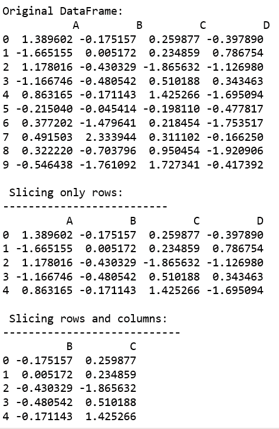
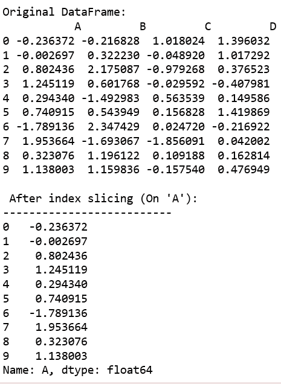

# python | pandas data frame . IX[]

> 哎哎哎:# t0]https://www . geeksforgeeks . org/python 熊猫 dataframe-ix/

Python 是进行数据分析的优秀语言，主要是因为以数据为中心的 Python 包的奇妙生态系统。 ***【熊猫】*** 就是其中一个包，让导入和分析数据变得容易多了。

熊猫`**DataFrame.ix[ ]**`是基于标签和整数的切片技术。除了基于纯标签和基于整数，Pandas 还提供了一种混合方法，用于使用`ix[]`操作符选择和细分对象。`ix[]`是最通用的索引器，将支持`[loc[]](https://www.geeksforgeeks.org/python-pandas-extracting-rows-using-loc/)`和`[iloc[]](https://www.geeksforgeeks.org/python-extracting-rows-using-pandas-iloc/)`中的任何输入。

> **语法:** DataFrame.ix[ ]
> 
> **参数:**
> **索引位置:**整数或整数列表中行的索引位置。
> **索引标签:**行索引标签的字符串或字符串列表
> 
> **根据参数返回:**数据帧或序列

**Code #1:**

```py
# importing pandas package 
import pandas as geek

# making data frame from csv file
data = geek.read_csv("https://media.geeksforgeeks.org/wp-content/uploads/nba.csv")  

# Integer slicing
print("Slicing only rows(till index 4):")
x1 = data.ix[:4, ]
print(x1, "\n")

print("Slicing rows and columns(rows=4, col 1-4, excluding 4):")
x2 = data.ix[:4, 1:4]
print(x2)
```

**输出:**



**代码#2:**

```py
# importing pandas package 
import pandas as geek

# making data frame from csv file
data = geek.read_csv("nba.csv")  

# Index slicing on Height column
print("After index slicing:")
x1 = data.ix[10:20, 'Height']
print(x1, "\n")

# Index slicing on Salary column
x2 = data.ix[10:20, 'Salary']
print(x2)
```

**输出:**



**代码#3:**

```py
# importing pandas and numpy
import pandas as pd
import numpy as np

df = pd.DataFrame(np.random.randn(10, 4),
          columns = ['A', 'B', 'C', 'D'])

print("Original DataFrame: \n" , df)

# Integer slicing
print("\n Slicing only rows:")
print("--------------------------")
x1 = df.ix[:4, ]
print(x1)

print("\n Slicing rows and columns:")
print("----------------------------")
x2 = df.ix[:4, 1:3]
print(x2)
```

**输出:**


**代码#4:**

```py
# importing pandas and numpy
import pandas as pd
import numpy as np

df = pd.DataFrame(np.random.randn(10, 4),
          columns = ['A', 'B', 'C', 'D'])

print("Original DataFrame: \n" , df)

# Integer slicing (printing all the rows of column 'A')
print("\n After index slicing (On 'A'):")
print("--------------------------")
x = df.ix[:, 'A']

print(x)
```

**输出:**
