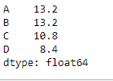
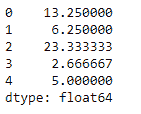

# Python | Pandas data frame . mean()

> 原文:[https://www.geeksforgeeks.org/python-pandas-dataframe-mean/](https://www.geeksforgeeks.org/python-pandas-dataframe-mean/)

Python 是进行数据分析的优秀语言，主要是因为以数据为中心的 python 包的奇妙生态系统。 ***【熊猫】*** 就是其中一个包，让导入和分析数据变得容易多了。

熊猫 `**dataframe.mean()**`函数返回所请求轴的平均值。如果该方法应用于 pandas 系列对象，则该方法返回一个标量值，该值是数据帧中所有观察值的平均值。如果该方法应用于 pandas dataframe 对象，则该方法返回一个 pandas series 对象，该对象包含指定轴上值的平均值。

> **语法:** DataFrame.mean(轴=无，skipna =无，级别=无，numeric _ only =无，**kwargs)
> 
> **参数:**
> **轴:**{索引(0)，列(1)}
> **skipna :** 计算结果时排除 NA/null 值
> 
> **级别:**如果轴是一个多索引(分层)，沿特定级别计数，折叠成一个系列
> 
> **numeric_only :** 仅包括浮点、整型和布尔型列。如果没有，将尝试使用所有内容，然后只使用数字数据。不适用于系列。
> 
> **返回:**表示:序列或数据帧(如果指定了级别)

**示例#1:** 使用`mean()`函数查找索引轴上所有观测值的平均值。

```
# importing pandas as pd
import pandas as pd

# Creating the dataframe 
df = pd.DataFrame({"A":[12, 4, 5, 44, 1],
                   "B":[5, 2, 54, 3, 2], 
                   "C":[20, 16, 7, 3, 8],
                   "D":[14, 3, 17, 2, 6]})

# Print the dataframe
df
```


让我们使用`dataframe.mean()`函数找到指数轴上的平均值。

```
# Even if we do not specify axis = 0,
# the method will return the mean over
# the index axis by default
df.mean(axis = 0)
```

**输出:**


**示例 2:** 对具有`Na`值的数据框使用`mean()`功能。还要找到柱轴上的平均值。

```
# importing pandas as pd
import pandas as pd

# Creating the dataframe 
df = pd.DataFrame({"A":[12, 4, 5, None, 1],
                   "B":[7, 2, 54, 3, None],
                   "C":[20, 16, 11, 3, 8],.
                   "D":[14, 3, None, 2, 6]})

# skip the Na values while finding the mean
df.mean(axis = 1, skipna = True)
```

**输出:**
