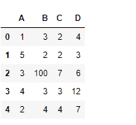
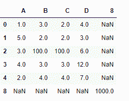

# Python | Pandas data frame . set _ value()

> 原文:[https://www . geesforgeks . org/python-pandas-data frame-set _ value/](https://www.geeksforgeeks.org/python-pandas-dataframe-set_value/)

Python 是进行数据分析的优秀语言，主要是因为以数据为中心的 python 包的奇妙生态系统。 ***【熊猫】*** 就是其中一个包，让导入和分析数据变得容易多了。

熊猫 `**dataframe.set_value()**`函数在传递的列和索引处放一个值。它将轴标签作为输入，并将标量值放在数据框中的指定索引处。该功能的替代产品是`.at[]`或`.iat[]`。

> **语法:** DataFrame.set_value(index，col，value，takable = False)
> **参数:**
> **index :** 行标签
> **col :** 列标签
> **值:**标量值
> **takable:**将索引/col 解释为索引器，默认为 False
> 
> **返回:**帧:数据帧如果包含标签对，将引用调用数据帧，否则为新对象

**示例#1:** 使用`set_value()`功能在特定索引处设置数据框中的值。

```py
# importing pandas as pd
import pandas as pd

# Creating the dataframe 
df = pd.DataFrame({"A":[1, 5, 3, 4, 2],
                   "B":[3, 2, 4, 3, 4], 
                   "C":[2, 2, 7, 3, 4],
                   "D":[4, 3, 6, 12, 7]})

# Print the dataframe
df
```


让我们使用`dataframe.set_value()`函数来设置特定索引的值。

```py
# set value of a cell which has index label "2" and column label "B"
df.set_value(2, 'B', 100)
```

**输出:**


**示例 2:** 使用`set_value()`功能设置数据框中不存在的索引和列的值。

```py
# importing pandas as pd
import pandas as pd

# Creating the dataframe 
df = pd.DataFrame({"A":[1, 5, 3, 4, 2],
                   "B":[3, 2, 4, 3, 4], 
                   "C":[2, 2, 7, 3, 4], 
                   "D":[4, 3, 6, 12, 7]})

# Print the dataframe
df
```


让我们使用`dataframe.set_value()`函数来设置特定索引的值。

```py
# set value of a cell which has index label "8" and column label "8"
df.set_value(8, 8, 1000)
```

**输出:**


请注意，对于 dataframe 中不存在的行和列，已经插入了新的行和列。