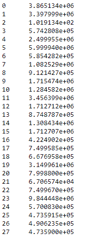

# python | pandas data frame . STD()

> 原文:[https://www.geeksforgeeks.org/python-pandas-dataframe-std/](https://www.geeksforgeeks.org/python-pandas-dataframe-std/)

Python 是进行数据分析的优秀语言，主要是因为以数据为中心的 python 包的奇妙生态系统。 ***【熊猫】*** 就是其中一个包，让导入和分析数据变得容易多了。

熊猫 `**dataframe.std()**`功能返回要求轴上的样本标准偏差。默认情况下，标准偏差用 N-1 归一化。这是一种用于量化一组数据值的变化量或离差的度量。更多信息请点击这里

> **语法:**data frame . STD(axis =无，skipna =无，level =无，ddof=1，numeric _ only =无，**kwargs)
> 
> **参数:**
> **轴:**{索引(0)，列(1)}
> **skipna :** 排除 NA/null 值。如果整行/整列是 NA，结果将是 NA
> **级别:**如果轴是多索引(分层)，沿特定级别计数，折叠成系列
> **ddof:**δ自由度。计算中使用的除数是 N–ddof，其中 N 代表元素的数量。
> **numeric_only :** 只包括 float、int、boolean 列。如果没有，将尝试使用所有内容，然后只使用数字数据。不适用于系列。
> 
> **返回:**标准:系列或数据帧(如果指定了级别)

有关代码中使用的 CSV 文件的链接，请单击此处的

**例#1:** 使用`std()`函数求数据沿指数轴的标准差。

```
# importing pandas as pd
import pandas as pd

# Creating the dataframe 
df = pd.read_csv("nba.csv")

# Print the dataframe
df
```


现在找到数据框中所有数值列的标准偏差。我们将跳过标准偏差计算中的`NaN`值。

```
# finding STD
df.std(axis = 0, skipna = True)
```

**输出:**


**例 2:** 使用`std()`函数求柱轴上的标准差。

求沿柱轴的标准偏差。我们要让 skipna 成真。如果我们不跳过`NaN`值，那么它将产生`NaN`值。

```
# importing pandas as pd
import pandas as pd

# Creating the dataframe 
df = pd.read_csv("nba.csv")

# STD over the column axis.
df.std(axis = 1, skipna = True)
```

**输出:**
