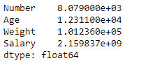

# Python | Pandas data frame . sum()

> 原文:[https://www.geeksforgeeks.org/python-pandas-dataframe-sum/](https://www.geeksforgeeks.org/python-pandas-dataframe-sum/)

Python 是进行数据分析的优秀语言，主要是因为以数据为中心的 python 包的奇妙生态系统。 ***【熊猫】*** 就是其中一个包，让导入和分析数据变得容易多了。

熊猫 `**dataframe.sum()**`函数返回所请求轴的数值总和。如果输入是索引轴，则它会将一列中的所有值相加，并对所有列重复相同的操作，然后返回一个包含每列中所有值之和的序列。它还支持在计算数据帧中的总和时跳过数据帧中缺失的值。

> **语法:** DataFrame.sum(轴=无，skipna =无，级别=无，numeric _ only =无，min_count=0，**kwargs)
> 
> **参数:**
> **轴:**{索引(0)，列(1)}
> **skipna :** 计算结果时排除 NA/null 值。
> **级别:**如果轴是多索引(分层的)，沿特定级别计数，折叠成系列
> **仅限数值:**仅包括浮点、int 和布尔列。如果没有，将尝试使用所有内容，然后只使用数字数据。不适用于系列。
> **min_count :** 执行操作所需的有效值数量。如果存在少于最小计数的非数值，结果将为“不适用”。
> 
> **返回:**总和:序列或数据帧(如果指定了级别)

有关代码中使用的 CSV 文件的链接，请单击此处的

**示例#1:** 使用`sum()`函数查找索引轴上所有值的总和。

```
# importing pandas as pd
import pandas as pd

# Creating the dataframe 
df = pd.read_csv("nba.csv")

# Print the dataframe
df
```


现在找到沿着索引轴的所有值的总和。我们将跳过总和计算中的`NaN`值。

```
# finding sum over index axis
# By default the axis is set to 0
df.sum(axis = 0, skipna = True)
```

**输出:**


**例 2:** 使用`sum()`函数求列轴上所有值的和。

现在我们将沿着列轴找到总和。我们要让 skipna 成真。如果我们不跳过`NaN`值，那么它将产生`NaN`值。

```
# importing pandas as pd
import pandas as pd

# Creating the dataframe 
df = pd.read_csv("nba.csv")

# sum over the column axis.
df.sum(axis = 1, skipna = True)
```

**输出:**
