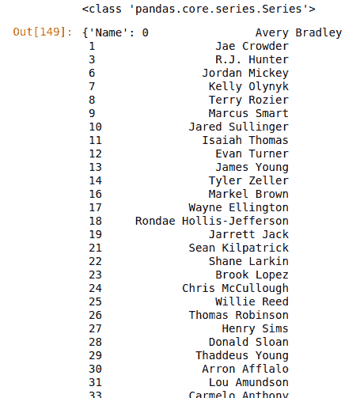

# Python | Pandas data frame . to _ dict()

> 原文:[https://www . geesforgeks . org/python-pandas-data frame-to _ dict/](https://www.geeksforgeeks.org/python-pandas-dataframe-to_dict/)

Python 是进行数据分析的优秀语言，主要是因为以数据为中心的 Python 包的奇妙生态系统。 ***【熊猫】*** 就是其中一个包，让导入和分析数据变得容易多了。

Pandas **`.to_dict()`** 方法用于根据 orient 参数将数据帧转换为系列或列表类数据类型的字典。

> **语法:**data frame . to _ dict(orient = ' dict '，into=)
> 
> **参数:**
> **方向:**字符串值(‘dict’，‘list’，‘series’，‘split’，‘records’，‘index’)定义要将列(系列)转换成哪种数据类型。例如，“列表”将返回关键字=列名和值=列表(已转换系列)的列表字典。
> **变为:**类，可以传递一个实际的类或实例。例如，在 defaultdict 的情况下，可以传递类的实例。这个参数的默认值是 dict。
> 
> **返回类型:**转换为字典的数据帧

要下载下例使用的数据集，点击这里的[。](https://media.geeksforgeeks.org/wp-content/uploads/nba.csv)
在下面的例子中，使用的数据框包含了一些 NBA 球员的数据。任何操作前的数据框图像附在下面。


**示例#1:** 默认转换为字典
在这种情况下，没有参数传递给 **`to_dict()`** 方法。因此，默认情况下，它会将数据帧转换为字典。

```py
# importing pandas module 
import pandas as pd

# reading csv file from url 
data = pd.read_csv("https://media.geeksforgeeks.org/wp-content/uploads/nba.csv")

# dropping null value columns to avoid errors
data.dropna(inplace = True)

# converting to dict
data_dict = data.to_dict()

# display
data_dict
```

**输出:**
如输出图像所示，字典的字典是由 to_dict()方法返回的。第一个字典的关键字是列名，该列以索引作为第二个字典的关键字存储。


**示例 2:** 转换为系列词典

在本例中，“序列”被传递给 orient 参数，以将数据框转换为序列字典。

```py
# importing pandas module 
import pandas as pd

# reading csv file from url 
data = pd.read_csv("https://media.geeksforgeeks.org/wp-content/uploads/nba.csv")

# dropping null value columns to avoid errors
data.dropna(inplace = True)

# converting to dict
data_dict = data.to_dict('series')

# printing datatype of first keys value in dict
print(type(data_dict['Name']))

# display
data_dict
```

**输出:**
如输出图像所示，由于 data_dict['Name']的类型为 pandas.core.series.Series，to_dict()返回了一个系列的字典。
