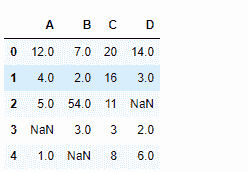

# Python | Pandas data frame . values

> 原文:[https://www . geesforgeks . org/python-pandas-data frame-values/](https://www.geeksforgeeks.org/python-pandas-dataframe-values/)

Pandas DataFrame 是一个二维可变大小、潜在异构的表格数据结构，带有标记轴(行和列)。算术运算在行标签和列标签上对齐。它可以被认为是系列对象的类似字典的容器。这是熊猫的主要数据结构。

熊猫 `**DataFrame.values**`属性返回给定数据帧的数字表示。

> **语法:**数据帧值
> 
> **参数:**无
> 
> **返回:**数组

**示例#1:** 使用`DataFrame.values`属性返回给定数据帧的 numpy 表示。

```py
# importing pandas as pd
import pandas as pd

# Creating the DataFrame
df = pd.DataFrame({'Weight':[45, 88, 56, 15, 71],
                   'Name':['Sam', 'Andrea', 'Alex', 'Robin', 'Kia'],
                   'Age':[14, 25, 55, 8, 21]})

# Print the DataFrame
print(df)
```

**输出:**


现在我们将使用`DataFrame.values`属性返回给定数据帧的 numpy 表示。

```py
# return the numpy representation of 
# this dataframe
result = df.values

# Print the result
print(result)
```

**输出:**


正如我们在输出中看到的那样，`DataFrame.values`属性已经成功地返回了给定数据帧的 numpy 表示。

**示例 2:** 使用`DataFrame.values`属性返回给定数据帧的 numpy 表示。

```py
# importing pandas as pd
import pandas as pd

# Creating the DataFrame
df = pd.DataFrame({"A":[12, 4, 5, None, 1], 
                   "B":[7, 2, 54, 3, None], 
                   "C":[20, 16, 11, 3, 8], 
                   "D":[14, 3, None, 2, 6]}) 

# Print the DataFrame
print(df)
```

**输出:**


现在我们将使用`DataFrame.values`属性返回给定数据帧的 numpy 表示。

```py
# return the numpy representation of 
# this dataframe
result = df.values

# Print the result
print(result)
```

**输出:**

正如我们在输出中看到的那样，`DataFrame.values`属性已经成功地返回了给定数据帧的 numpy 表示。