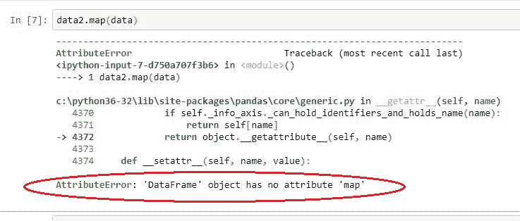

# Python | pandas.map()

> 原文:[https://www.geeksforgeeks.org/python-pandas-map/](https://www.geeksforgeeks.org/python-pandas-map/)

pandas.map()用于映射一列相同的两个系列的值。对于映射两个系列，第一个系列的最后一列应该与第二个系列的索引列相同，并且值应该是唯一的。

**语法:**

```
Series.map(arg, na_action=None)
```

> **参数:**
> 
> **arg :** 函数、dict 或 Series
> 
> **na _ action:***{无，【忽略】}* 如果“**忽略**”，传播 NA 值，而不将其传递给映射对应关系。 **na_action** 检查 na 值并在映射时忽略它，以防“忽略”

**返回类型:**

```
Pandas Series with same as index as caller
```

**示例#1:**
在以下示例中，两个系列由相同的数据组成。pokemon_names 列和 pokemon_types 索引列是相同的，因此 Pandas.map()匹配两个列的其余部分，并返回一个新的序列。

> **注意:**
> **->**map 函数调用者的第二列必须与传递序列的索引列相同。
> **- >** 常用列的值也必须唯一。

```
import pandas as pd

#reading csv files
pokemon_names = pd.read_csv("pokemon.csv", usecols = ["Pokemon"],
                                                  squeeze = True)

#usecol is used to use selected columns
#index_col is used to make passed column as index
pokemon_types = pd.read_csv("pokemon.csv", index_col = "Pokemon",
                                                  squeeze = True)

#using pandas map function
new=pokemon_names.map(pokemon_types)

print (new)
```

**输出:**


**例 2:**

此功能仅适用于系列。传递数据帧会产生属性错误。传递不同长度的序列将给出与调用者相同长度的输出序列。

