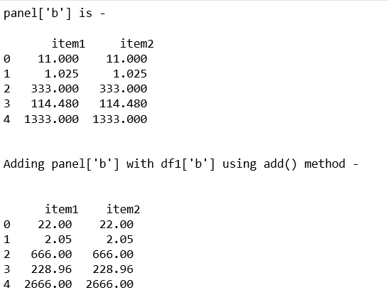
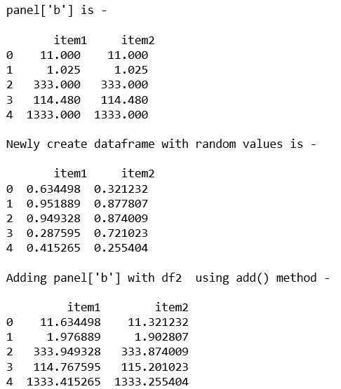
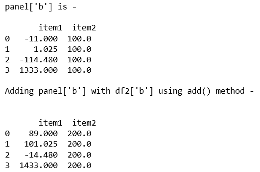

# 蟒蛇|熊猫面板. add()

> 原文:[https://www.geeksforgeeks.org/python-pandas-panel-add/](https://www.geeksforgeeks.org/python-pandas-panel-add/)

在熊猫中，面板是一个非常重要的三维数据容器。三个轴的名称旨在为描述涉及面板数据的操作，特别是面板数据的计量经济学分析提供一些语义含义。

在熊猫 **`Panel.add()`** 中，函数用于序列和序列/数据帧的元素相加。

> **语法:** Panel.add(其他，轴=0)
> 
> **参数:**
> **其他:**数据框或面板
> **轴:**轴广播结束
> 
> **返回:**面板

**代码#1:**

```
# importing pandas module  
import pandas as pd  
import numpy as np 

df1 = pd.DataFrame({'a': ['Geeks', 'For', 'geeks', 'for', 'real'],  
                    'b': [11, 1.025, 333, 114.48, 1333]}) 

data = {'item1':df1, 'item2':df1} 

# creating Panel  
panel = pd.Panel.from_dict(data, orient ='minor') 

print("panel['b'] is - \n\n", panel['b'], '\n') 

print("\nAdding panel['b'] with df1['b'] using add() method - \n")   
print("\n", panel['b'].add(df1['b'], axis = 0)) 
```

**输出:**


**代码#2:**

```
# importing pandas module  
import pandas as pd  
import numpy as np 

df1 = pd.DataFrame({'a': ['Geeks', 'For', 'geeks', 'for', 'real'],  
                    'b': [11, 1.025, 333, 114.48, 1333]}) 

data = {'item1':df1, 'item2':df1} 

# creating Panel  
panel = pd.Panel.from_dict(data, orient ='minor') 
print("panel['b'] is - \n\n", panel['b'], '\n') 

# Create a 5 * 5 dataframe 
df2 = pd.DataFrame(np.random.rand(5, 2), columns =['item1', 'item2']) 
print("Newly create dataframe with random values is - \n\n", df2)

print("\nAdding panel['b'] with df2  using add() method - \n")  
print(panel['b'].add(df2, axis = 0)) 
```

**输出:**


**代码#3:**

```
# importing pandas module 
import pandas as pd 
import numpy as np 

df1 = pd.DataFrame({'a': ['Geeks', 'For', 'geeks', 'real'], 
                    'b': [-11, +1.025, -114.48, 1333]}) 

df2 = pd.DataFrame({'a': ['I', 'am', 'dataframe', 'two'], 
                    'b': [100, 100, 100, 100]}) 

data = {'item1':df1, 'item2':df2}

# creating Panel 
panel = pd.Panel.from_dict(data, orient ='minor') 
print("panel['b'] is - \n\n", panel['b']) 

print("\nAdding panel['b'] with df2['b'] using add() method - \n")   
print("\n", panel['b'].add(df2['b'], axis = 0)) 
```

**输出:**
